# SYNAPSE — Flowcharts & System Diagrams

> Guia visual completo de como o SYNAPSE funciona: pipeline, layers, domains,
> conexoes com Memory Intelligence System (MIS) e Activation Pipeline (UAP).

**Versao:** 2.0.0
**Data:** 2026-02-14
**Autor:** @architect (Aria)
**Status:** Living Document
**Atualizado:** SYN-14 — Diagnostics v2, Metrics Persistence, Deep Observability

---

## 1. Visao Geral do Sistema

O SYNAPSE (Synkra Adaptive Processing & State Engine) e o motor de contexto JIT do AIOS.
A cada prompt do usuario, ele injeta `<synapse-rules>` com regras contextuais adaptativas.

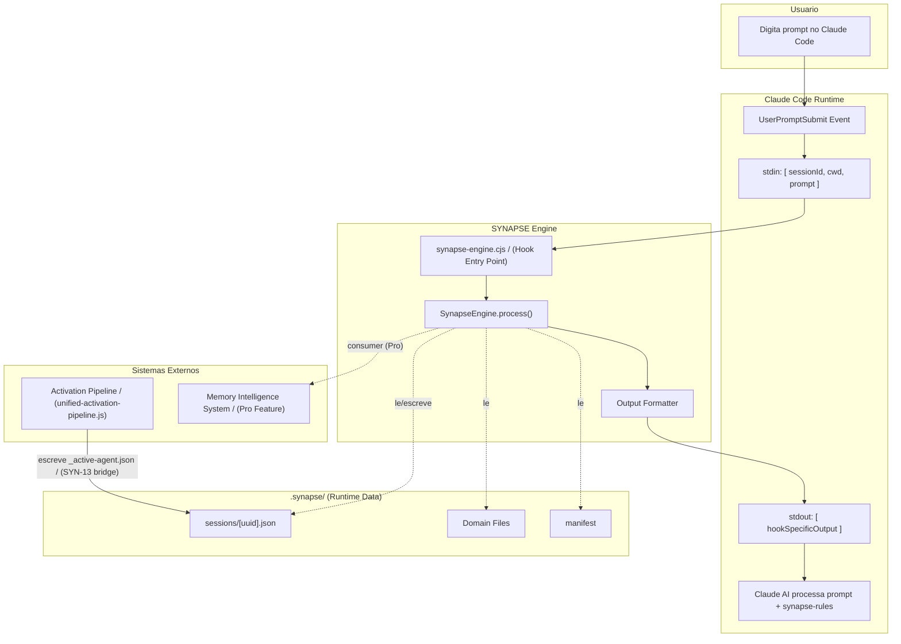

---

## 2. Hook Entry Point — Ciclo de Vida por Prompt

Cada prompt do usuario dispara o hook. O entry point e fino (~78 linhas)
e delega todo o trabalho para o SynapseEngine.

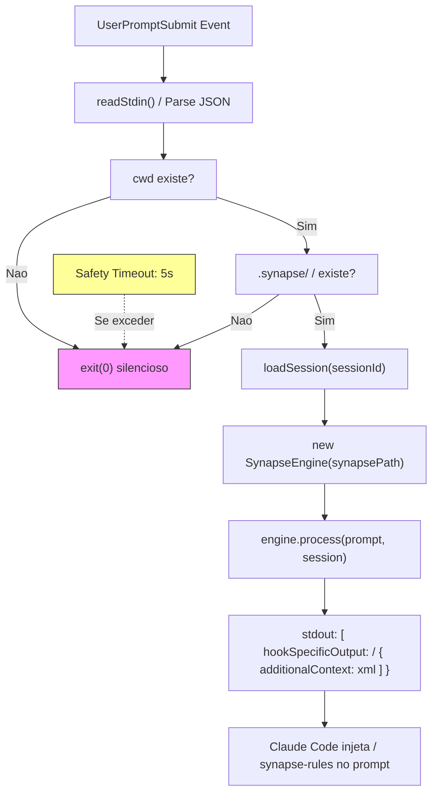

---

## 3. Pipeline de 8 Layers — Fluxo Principal

O engine executa os layers sequencialmente (L0→L7), respeitando
o Context Bracket que determina quais layers estao ativos.

```mermaid
flowchart LR
    INPUT["prompt / session / config"] --> BRACKET["Context Tracker / calcula bracket"]
    BRACKET --> L0["L0: Constitution / 5ms | NON-NEGOTIABLE"]
    L0 --> L1["L1: Global / 10ms | ALWAYS_ON"]
    L1 --> L2["L2: Agent / 15ms | session.active_agent"]
    L2 --> L3["L3: Workflow / 15ms | session.active_workflow"]
    L3 --> L4["L4: Task / 15ms | session.active_task"]
    L4 --> L5["L5: Squad / 15ms | session.active_squad"]
    L5 --> L6["L6: Keyword / 15ms | RECALL matching"]
    L6 --> L7["L7: Star-Command / 5ms | *command detection"]
    L7 --> MEM["Memory / Bridge"]
    MEM --> FORMAT["Output Formatter / → "]

    style L0 fill:#ff6b6b,color:#fff
    style L1 fill:#4ecdc4,color:#fff
    style L2 fill:#45b7d1,color:#fff
    style L3 fill:#96ceb4,color:#fff
    style L4 fill:#ffeaa7,color:#333
    style L5 fill:#dfe6e9,color:#333
    style L6 fill:#a29bfe,color:#fff
    style L7 fill:#fd79a8,color:#fff
    style MEM fill:#6c5ce7,color:#fff
```

---

## 4. Context Brackets — Layers Ativos por Bracket

O Context Tracker estima o % de contexto restante baseado no prompt_count
e seleciona quais layers executar.

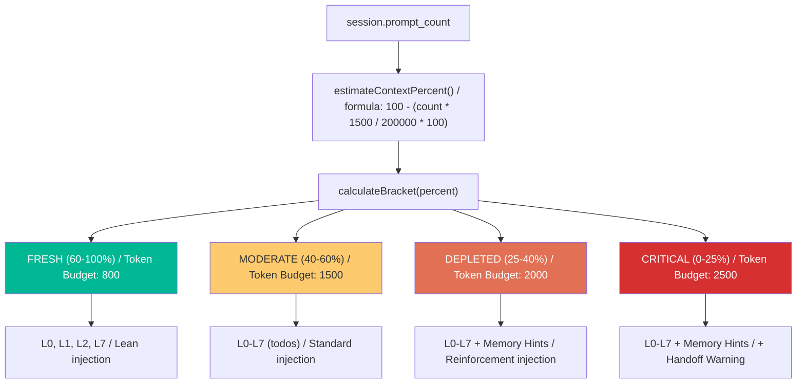

### Tabela de Brackets

| Bracket | Context % | Layers Ativos | Token Budget | Memory Hints | Handoff Warning |
|---------|-----------|---------------|-------------|-------------|-----------------|
| FRESH | 60-100% | L0, L1, L2, L7 | 800 | Nao | Nao |
| MODERATE | 40-60% | L0-L7 (todos) | 1500 | Nao | Nao |
| DEPLETED | 25-40% | L0-L7 (todos) | 2000 | Sim | Nao |
| CRITICAL | 0-25% | L0-L7 (todos) | 2500 | Sim | Sim |

---

## 5. Domain System — Manifest + Domain Files

O `.synapse/manifest` e o registro central de todos os domains.
Cada domain tem um arquivo com regras em formato KEY=VALUE ou plain text.

```mermaid
flowchart TD
    subgraph MANIFEST[".synapse/manifest (KEY=VALUE)"]
        M_CONST["CONSTITUTION_STATE=active / CONSTITUTION_ALWAYS_ON=true / CONSTITUTION_NON_NEGOTIABLE=true"]
        M_GLOBAL["GLOBAL_STATE=active / GLOBAL_ALWAYS_ON=true"]
        M_AGENT["AGENT_DEV_STATE=active / AGENT_DEV_AGENT_TRIGGER=dev"]
        M_WORKFLOW["WORKFLOW_STORY_DEV_STATE=active / WORKFLOW_STORY_DEV_WORKFLOW_TRIGGER=story_development"]
        M_DEVMODE["DEVMODE=false"]
    end

    subgraph DOMAINS[".synapse/ Domain Files"]
        D_CONST["constitution / (6 artigos, NON-NEGOTIABLE)"]
        D_GLOBAL["global / (regras globais, ALWAYS_ON)"]
        D_CONTEXT["context / (brackets, ALWAYS_ON)"]
        D_COMMANDS["commands / ([*command] blocks)"]
        D_AGENT["agent-dev / agent-qa / agent-architect / agent-pm / agent-po / agent-sm / agent-devops / agent-analyst / agent-data-engineer / agent-ux / agent-aios-master / agent-squad-creator"]
        D_WORKFLOW["workflow-story-dev / workflow-epic-create / workflow-arch-review"]
    end

    MANIFEST -->|"parseManifest()"| LOADER["DomainLoader"]
    LOADER -->|"loadDomainFile()"| DOMAINS

    subgraph TRIGGER["Mecanismos de Ativacao"]
        T_ALWAYS["ALWAYS_ON=true / → Carrega sempre"]
        T_AGENT["AGENT_TRIGGER=id / → Quando agent ativo"]
        T_WORKFLOW["WORKFLOW_TRIGGER=id / → Quando workflow ativo"]
        T_KEYWORD["RECALL=keywords / → Keyword no prompt"]
        T_COMMAND["*command no prompt / → Star-command match"]
    end
```

### Domain Attributes

| Attribute | Formato | Funcao |
|-----------|---------|--------|
| `[DOMAIN]_STATE` | `active\|inactive` | Liga/desliga o domain |
| `[DOMAIN]_ALWAYS_ON` | `true` | Carrega em TODO prompt |
| `[DOMAIN]_NON_NEGOTIABLE` | `true` | Nao pode ser desligado |
| `[DOMAIN]_AGENT_TRIGGER` | `agent_id` | Ativa quando agent ativo |
| `[DOMAIN]_WORKFLOW_TRIGGER` | `workflow_id` | Ativa quando workflow ativo |
| `[DOMAIN]_RECALL` | `kw1,kw2,...` | Ativa por keyword match |
| `[DOMAIN]_EXCLUDE` | `skip1,skip2,...` | Exclui quando keyword presente |

---

## 6. Session Management — Estado Persistente

Cada sessao Claude Code tem um arquivo JSON em `.synapse/sessions/`.
A session rastreia agent ativo, workflow, task, squad e historico.

```mermaid
flowchart TD
    subgraph SESSION_SCHEMA["Session Schema v2.0"]
        UUID["uuid: session-id"]
        AGENT["active_agent: / [ id, activated_at, activation_quality ]"]
        WORKFLOW["active_workflow: / [ id, current_phase ]"]
        TASK["active_task: story-id"]
        SQUAD["active_squad: squad-name"]
        CONTEXT["context: / [ last_bracket, last_tokens_used, / last_context_percent ]"]
        HISTORY["history: / [ star_commands_used, / domains_loaded_last, / agents_activated ]"]
        META["prompt_count | last_activity | title"]
    end

    subgraph LIFECYCLE["Ciclo de Vida"]
        CREATE["createSession(id, cwd)"]
        LOAD["loadSession(id, dir)"]
        UPDATE["updateSession(id, dir, updates) / → prompt_count++ / → last_activity = now"]
        CLEAN["cleanStaleSessions(dir, 24h)"]
        DELETE["deleteSession(id, dir)"]
    end

    CREATE -->|"Primeiro prompt"| LOAD
    LOAD -->|"Cada prompt"| UPDATE
    UPDATE -->|"Proximos prompts"| LOAD
    CLEAN -->|">24h inativo"| DELETE

    subgraph CONSUMERS["Quem Escreve na Session"]
        C_HOOK["synapse-engine.cjs / (per-prompt update)"]
        C_UAP["UnifiedActivationPipeline / (seta active_agent)"]
        C_SM["Scrum Master workflow / (seta active_workflow)"]
    end

    C_HOOK --> UPDATE
    C_UAP -->|"escreve _active-agent.json / (SYN-13 bridge)"| UPDATE
    C_SM -.->|"futuro"| UPDATE
```

---

## 7. Conexao com Activation Pipeline (UAP)

O SYNAPSE **NAO substitui** o UnifiedActivationPipeline — ele o **complementa**.
O UAP executa na ativacao do agente (uma vez). O SYNAPSE executa a cada prompt.

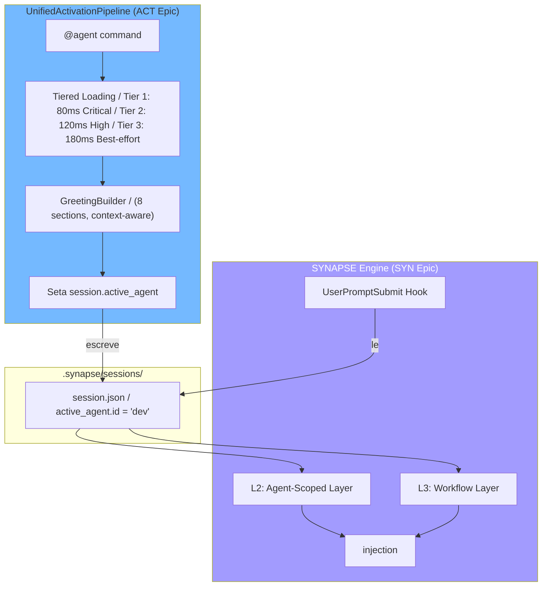

### Separacao de Responsabilidades

| Aspecto | UAP (Activation Pipeline) | SYNAPSE Engine |
|---------|--------------------------|----------------|
| **Trigger** | `@agent` command (uma vez) | Cada prompt (automatico) |
| **Funcao** | Greeting + agent config | Context injection |
| **Performance** | 168ms p50 (one-shot) | &lt;100ms per-prompt |
| **Output** | Greeting visual no terminal | `<synapse-rules>` invisivel |
| **Session** | Escreve `active_agent` | Le `active_agent` para L2 |

---

## 8. Conexao com Memory Intelligence System (MIS)

O SYNAPSE consome o MIS via **MemoryBridge** — um consumer feature-gated
que so ativa com licenca Pro. Nunca modifica a memoria, apenas le.

```mermaid
flowchart TD
    subgraph SYNAPSE["SYNAPSE Engine"]
        ENGINE["SynapseEngine.process()"]
        BRIDGE["MemoryBridge"]
        CHECK_BRACKET["needsMemoryHints(bracket)?"]
    end

    subgraph GATE["Feature Gate (Pro)"]
        FG_CHECK["featureGate.isAvailable / ('pro.memory.synapse')?"]
    end

    subgraph MIS["Memory Intelligence System (Pro)"]
        PROVIDER["SynapseMemoryProvider"]
        MEMORY_STORE["Memory Store / (4 camadas MIS)"]
    end

    subgraph BRACKET_MAP["Bracket → Memory Layer"]
        B_FRESH["FRESH → skip (0 tokens)"]
        B_MOD["MODERATE → Layer 1 metadata (50 tokens)"]
        B_DEP["DEPLETED → Layer 2 chunks (200 tokens)"]
        B_CRIT["CRITICAL → Layer 3 full content (1000 tokens)"]
    end

    ENGINE --> CHECK_BRACKET
    CHECK_BRACKET -->|"FRESH"| SKIP["Skip — sem memory hints"]
    CHECK_BRACKET -->|"DEPLETED/CRITICAL"| BRIDGE

    BRIDGE --> FG_CHECK
    FG_CHECK -->|"Nao (open-source)"| EMPTY["return [] / (graceful no-op)"]
    FG_CHECK -->|"Sim (Pro)"| PROVIDER

    PROVIDER -->|"getMemories(agent, bracket, budget)"| MEMORY_STORE
    MEMORY_STORE --> HINTS["Memory Hints[]"]
    HINTS --> BUDGET["enforceTokenBudget()"]
    BUDGET --> FORMAT["Formatter → [MEMORY HINTS] / section no output"]

    BRIDGE -.->|"Timeout: 15ms"| TIMEOUT["return []"]

    style SKIP fill:#00b894,color:#fff
    style EMPTY fill:#fdcb6e,color:#333
    style TIMEOUT fill:#ff7675,color:#fff
```

### Caracteristicas do MemoryBridge

| Aspecto | Detalhe |
|---------|---------|
| **Tipo** | Consumer only (read-only) |
| **Feature Gate** | `pro.memory.synapse` |
| **Timeout** | 15ms (hard limit) |
| **Fallback** | return [] (graceful no-op) |
| **Cache** | Session-level via provider |
| **Lazy Load** | Provider carregado sob demanda |

---

## 9. Output Formatter — Montagem do XML Final

O formatter recebe os resultados de todos os layers e monta o
`<synapse-rules>` XML respeitando ordem de secoes e token budget.

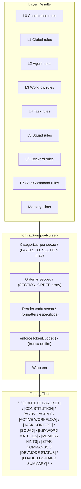

### Ordem de Secoes (prioridade de truncamento)

Quando o token budget e excedido, secoes sao removidas do FIM primeiro:

| # | Secao | Protegida? | Truncamento |
|---|-------|-----------|-------------|
| 1 | CONTEXT_BRACKET | Sim | Nunca removida |
| 2 | CONSTITUTION | Sim | Nunca removida |
| 3 | AGENT | Sim | Nunca removida |
| 4 | WORKFLOW | Nao | Removida por ultimo |
| 5 | TASK | Nao | Removida 5o |
| 6 | SQUAD | Nao | Removida 4o |
| 7 | KEYWORD | Nao | Removida 2o |
| 8 | MEMORY_HINTS | Nao | Removida 3o |
| 9 | STAR_COMMANDS | Nao | Removida 4o |
| 10 | DEVMODE | Nao | Removida 5o |
| 11 | SUMMARY | Nao | Removida 1o (primeiro a sair) |

---

## 10. Fallback & Error Recovery

Cada camada do SYNAPSE implementa graceful degradation.
Nenhum erro bloqueia o prompt do usuario.

```mermaid
flowchart TD
    subgraph LAYER_FALLBACK["Per-Layer Fallback"]
        TRY["LayerProcessor._safeProcess()"] --> CHECK["Sucesso?"]
        CHECK -->|"Sim"| RETURN["Retorna rules[]"]
        CHECK -->|"Timeout > budget"| WARN["console.warn + retorna result"]
        CHECK -->|"Error"| NULL["Retorna null (skip layer)"]
    end

    subgraph PIPELINE_FALLBACK["Pipeline Fallback"]
        PIPE_START["Pipeline start"] --> PIPE_CHECK["Elapsed > 100ms?"]
        PIPE_CHECK -->|"Sim"| PIPE_SKIP["Skip remaining layers / (reason: Pipeline timeout)"]
        PIPE_CHECK -->|"Nao"| PIPE_NEXT["Executa proximo layer"]
    end

    subgraph HOOK_FALLBACK["Hook Entry Fallback"]
        HOOK_ERROR["Qualquer erro no main()"] --> HOOK_EXIT["console.error + exit(0) / (nunca bloqueia prompt)"]
        HOOK_TIMEOUT["Safety timeout: 5s"] --> HOOK_EXIT
    end

    subgraph MEMORY_FALLBACK["Memory Bridge Fallback"]
        MEM_NO_PRO["Pro nao instalado"] --> MEM_EMPTY["return []"]
        MEM_TIMEOUT["Timeout > 15ms"] --> MEM_EMPTY
        MEM_ERROR["Provider erro"] --> MEM_EMPTY
    end

    style NULL fill:#ffeaa7,color:#333
    style PIPE_SKIP fill:#fab1a0,color:#333
    style HOOK_EXIT fill:#ff7675,color:#fff
    style MEM_EMPTY fill:#81ecec,color:#333
```

---

## 11. Layer Processing Detail — Cada Layer Explicado

```mermaid
flowchart TD
    subgraph L0["L0: Constitution (5ms)"]
        L0_IN["Trigger: ALWAYS_ON + NON_NEGOTIABLE"]
        L0_LOAD["Carrega .synapse/constitution"]
        L0_OUT["6 Artigos constitucionais / CLI First, Agent Authority, etc."]
        L0_IN --> L0_LOAD --> L0_OUT
    end

    subgraph L1["L1: Global (10ms)"]
        L1_IN["Trigger: ALWAYS_ON"]
        L1_LOAD["Carrega .synapse/global"]
        L1_OUT["Regras globais aplicaveis / a todo contexto"]
        L1_IN --> L1_LOAD --> L1_OUT
    end

    subgraph L2["L2: Agent-Scoped (15ms)"]
        L2_IN["Trigger: session.active_agent.id"]
        L2_MATCH["Busca AGENT_[X]_AGENT_TRIGGER=[id] / no manifest"]
        L2_LOAD["Carrega .synapse/agent-[id]"]
        L2_OUT["Regras do agente ativo / + authority boundaries"]
        L2_IN --> L2_MATCH --> L2_LOAD --> L2_OUT
    end

    subgraph L3["L3: Workflow (15ms)"]
        L3_IN["Trigger: session.active_workflow.id"]
        L3_MATCH["Busca WORKFLOW_[X]_WORKFLOW_TRIGGER=[id] / no manifest"]
        L3_LOAD["Carrega .synapse/workflow-[id]"]
        L3_OUT["Regras do workflow ativo / + fase atual"]
        L3_IN --> L3_MATCH --> L3_LOAD --> L3_OUT
    end

    subgraph L4["L4: Task (15ms)"]
        L4_IN["Trigger: session.active_task"]
        L4_OUT["Contexto da task ativa / (story ID, pre-conditions, AC)"]
        L4_IN --> L4_OUT
    end

    subgraph L5["L5: Squad (15ms)"]
        L5_IN["Trigger: session.active_squad"]
        L5_OUT["Regras do squad ativo / (dynamic domain discovery)"]
        L5_IN --> L5_OUT
    end

    subgraph L6["L6: Keyword (15ms)"]
        L6_IN["Trigger: RECALL keywords no prompt"]
        L6_SCAN["Varre manifest: [DOMAIN]_RECALL=kw1,kw2"]
        L6_MATCH["matchKeywords(prompt, recall)"]
        L6_EXCL["isExcluded(prompt, excludes)?"]
        L6_LOAD["Carrega domain files matchados"]
        L6_OUT["Regras de domains ativados / por keyword"]
        L6_IN --> L6_SCAN --> L6_MATCH --> L6_EXCL
        L6_EXCL -->|"Nao excluido"| L6_LOAD --> L6_OUT
        L6_EXCL -->|"Excluido"| L6_SKIP["Skip domain"]
    end

    subgraph L7["L7: Star-Command (5ms)"]
        L7_IN["Trigger: *command no prompt"]
        L7_REGEX["Regex: /\\*([a-z][\\w-]*)/gi"]
        L7_LOAD["Carrega .synapse/commands"]
        L7_PARSE["Extrai bloco [*command]"]
        L7_OUT["Regras do comando detectado"]
        L7_IN --> L7_REGEX --> L7_LOAD --> L7_PARSE --> L7_OUT
    end
```

---

## 12. Fluxo Completo End-to-End (Exemplo Real)

Cenario: usuario ativa `@dev` e depois digita `*draft uma feature de login`

```mermaid
sequenceDiagram
    participant U as Usuario
    participant CC as Claude Code
    participant UAP as Activation Pipeline
    participant H as synapse-engine.cjs
    participant E as SynapseEngine
    participant S as Session Manager
    participant D as Domain Loader
    participant M as Memory Bridge
    participant F as Formatter

    Note over U,CC: Fase 1: Ativacao do Agente
    U->>CC: @dev
    CC->>UAP: activate('dev')
    UAP->>S: createSession() ou updateSession() / active_agent = [ id: 'dev' ]
    UAP->>CC: Greeting: "Dex ready!"

    Note over U,CC: Fase 2: Prompt Normal
    U->>CC: *draft uma feature de login
    CC->>H: UserPromptSubmit / [ sessionId, cwd, prompt ]

    H->>S: loadSession(sessionId)
    S-->>H: session [ active_agent: 'dev', prompt_count: 5 ]

    H->>E: process(prompt, session)

    Note over E: Context Bracket
    E->>E: estimateContextPercent(5) = 96.25%
    E->>E: calculateBracket(96.25) = FRESH
    E->>E: getActiveLayers(FRESH) = [L0, L1, L2, L7]

    Note over E,D: Layer Execution
    E->>D: L0: loadDomainFile('constitution')
    D-->>E: 6 constitutional rules

    E->>D: L1: loadDomainFile('global')
    D-->>E: global rules

    E->>D: L2: agent_trigger='dev' → loadDomainFile('agent-dev')
    D-->>E: dev agent rules + authority

    Note over E: L3-L6 SKIPPED (FRESH bracket)

    E->>D: L7: detect *draft → loadDomainFile('commands')
    D-->>E: [*draft] command rules

    E->>M: needsMemoryHints(FRESH)?
    M-->>E: false → skip

    E->>F: formatSynapseRules(results, FRESH, 96.25, session)
    F-->>E: ...[CONSTITUTION]...[AGENT: @dev]...[*draft]...

    E-->>H: [ xml, metrics ]
    H-->>CC: [ hookSpecificOutput: { additionalContext: xml ] }
    CC->>CC: Injeta synapse-rules no prompt
    CC->>U: Resposta com contexto de @dev + *draft
```

---

## 13. Arvore de Arquivos — Mapa Completo

```
aios-core/
├── .claude/
│   ├── hooks/
│   │   └── synapse-engine.cjs              # Hook entry point (106 linhas)
│   ├── commands/synapse/                  # CRUD commands (SYN-9)
│   │   ├── manager.md                     # Command router
│   │   ├── tasks/
│   │   │   ├── add-rule.md                # Add rule to domain
│   │   │   ├── create-command.md          # Create star-command
│   │   │   ├── create-domain.md           # Create new domain
│   │   │   ├── diagnose-synapse.md        # Run *synapse-diagnose
│   │   │   ├── edit-rule.md               # Edit existing rule
│   │   │   ├── suggest-domain.md          # AI-powered domain suggestion
│   │   │   └── toggle-domain.md           # Enable/disable domain
│   │   ├── templates/
│   │   │   ├── domain-template            # Domain file template
│   │   │   └── manifest-entry-template    # Manifest entry template
│   │   └── utils/
│   │       └── manifest-parser-reference.md # Manifest syntax ref
│   └── skills/synapse/                    # SYNAPSE skill (SYN-11)
│       ├── SKILL.md                       # Main skill definition
│       ├── references/
│       │   ├── brackets.md                # Context brackets ref
│       │   ├── commands.md                # Star-commands ref
│       │   ├── domains.md                 # Domains ref
│       │   ├── layers.md                  # 8-layer hierarchy ref
│       │   └── manifest.md                # Manifest syntax ref
│       └── assets/
│           └── README.md                  # Skills assets doc
│
├── .aios-core/core/synapse/               # Engine core (modular)
│   ├── engine.js                          # SynapseEngine orchestrator
│   ├── context/
│   │   └── context-tracker.js             # Bracket calculation (SYN-3)
│   ├── domain/
│   │   └── domain-loader.js               # Manifest parser + domain loader (SYN-1)
│   ├── layers/
│   │   ├── layer-processor.js             # Abstract base class
│   │   ├── l0-constitution.js             # NON-NEGOTIABLE rules (SYN-4)
│   │   ├── l1-global.js                   # Global ALWAYS_ON rules (SYN-4)
│   │   ├── l2-agent.js                    # Agent-scoped rules (SYN-4)
│   │   ├── l3-workflow.js                 # Workflow-scoped rules (SYN-4)
│   │   ├── l4-task.js                     # Task context (SYN-5)
│   │   ├── l5-squad.js                    # Squad domains (SYN-5)
│   │   ├── l6-keyword.js                  # RECALL keyword matching (SYN-5)
│   │   └── l7-star-command.js             # *command detection (SYN-5)
│   ├── memory/
│   │   └── memory-bridge.js               # MIS consumer, Pro-gated (SYN-10)
│   ├── output/
│   │   └── formatter.js                   # XML output formatter (SYN-6)
│   ├── session/
│   │   └── session-manager.js             # Session CRUD + cleanup (SYN-2)
│   ├── diagnostics/                       # Observability (SYN-13/SYN-14)
│   │   ├── synapse-diagnostics.js         # Orchestrator — 10 collectors
│   │   ├── report-formatter.js            # 12-section markdown report
│   │   └── collectors/
│   │       ├── safe-read-json.js          # Shared JSON reader util
│   │       ├── hook-collector.js          # Hook registration checks
│   │       ├── session-collector.js       # Session state checks
│   │       ├── manifest-collector.js      # Manifest integrity checks
│   │       ├── pipeline-collector.js      # Layer execution simulation
│   │       ├── uap-collector.js           # UAP bridge status
│   │       ├── timing-collector.js        # Performance timing (SYN-12)
│   │       ├── quality-collector.js       # Quality scoring rubric (SYN-12)
│   │       ├── consistency-collector.js   # Cross-pipeline validation (SYN-14)
│   │       ├── output-analyzer.js         # Output quality checks (SYN-14)
│   │       └── relevance-matrix.js        # Agent relevance mapping (SYN-14)
│   ├── scripts/
│   │   └── generate-constitution.js       # Auto-gen constitution domain
│   └── utils/
│       ├── paths.js                       # Path resolution helpers
│       └── tokens.js                      # Token estimation
│
├── .synapse/                              # Runtime data (gitignored sessions/)
│   ├── manifest                           # Domain registry (KEY=VALUE)
│   ├── constitution                       # L0 domain (auto-generated)
│   ├── global                             # L1 domain
│   ├── context                            # L1 context brackets
│   ├── commands                           # L7 star-command blocks
│   ├── agent-{id}                         # L2 agent domains (12 agents)
│   ├── workflow-{id}                      # L3 workflow domains (3 workflows)
│   ├── sessions/                          # Session JSON files (gitignored)
│   ├── metrics/                           # Performance metrics (SYN-12/SYN-14)
│   │   ├── uap-metrics.json              # UAP timing (written at activation)
│   │   └── hook-metrics.json             # Hook timing (written per-prompt)
│   └── cache/                             # Cache dir (gitignored)
│
├── .aios-core/development/scripts/
│   ├── unified-activation-pipeline.js     # UAP — agent activation + metrics
│   └── greeting-builder.js               # Greeting assembly
│
├── tests/synapse/                         # Test suite (749 tests)
│   ├── engine.test.js                     # Engine orchestrator tests
│   ├── context-tracker.test.js            # Bracket tracker tests
│   ├── domain-loader.test.js              # Domain loader tests
│   ├── session-manager.test.js            # Session manager tests
│   ├── formatter.test.js                  # Output formatter tests
│   ├── memory-bridge.test.js              # Memory bridge tests
│   ├── hook-entry.test.js                 # Hook entry point tests
│   ├── l0-l7 tests                        # Per-layer tests (8 files)
│   ├── diagnostics/                       # Diagnostics tests (SYN-13/SYN-14)
│   │   ├── collectors.test.js             # All collectors integration
│   │   ├── report-formatter.test.js       # Report formatter tests
│   │   ├── timing-collector.test.js       # Timing collector tests
│   │   ├── quality-collector.test.js      # Quality scoring tests
│   │   ├── consistency-collector.test.js  # Consistency check tests
│   │   ├── output-analyzer.test.js        # Output analyzer tests
│   │   ├── relevance-matrix.test.js       # Relevance matrix tests
│   │   └── qa-issues-validation.test.js   # QA issue regression tests
│   ├── bridge/
│   │   └── uap-session-bridge.test.js     # UAP bridge integration
│   ├── e2e/                               # End-to-end scenarios (6 files)
│   └── benchmarks/
│       └── pipeline-benchmark.js          # Performance benchmarks
│
└── pro/                                   # Pro submodule (proprietary)
    ├── license/
    │   └── feature-gate.js                # Feature gate for Pro
    └── memory/
        └── synapse-memory-provider.js     # MIS provider for SYNAPSE
```

---

## 14. Relacao entre Epics

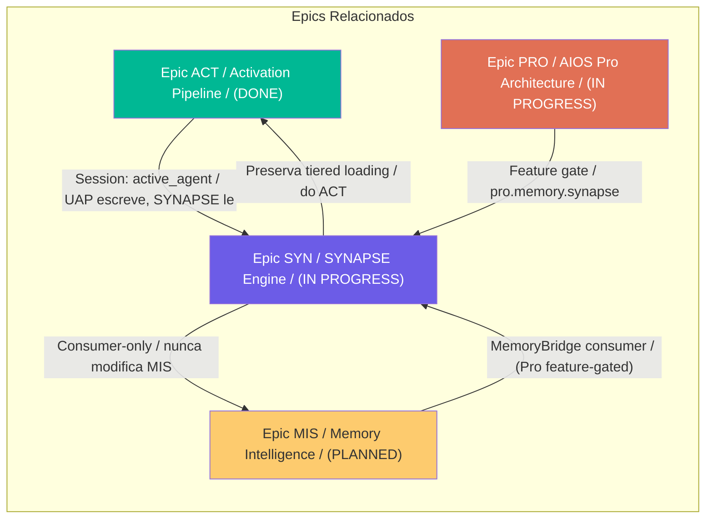

---

## 15. Diagnostics Pipeline — *synapse-diagnose (SYN-13/SYN-14)

O comando `*synapse-diagnose` executa 10 collectors em sequencia,
cada um isolado via `_safeCollect()` (nunca crasha o diagnostico inteiro).

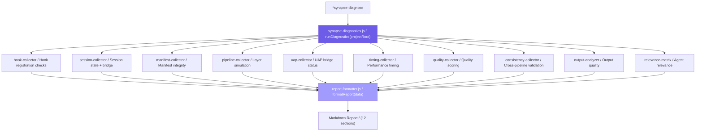

### Report Sections (12 total)

| # | Section | Collector Source | Key Data |
|---|---------|----------------|----------|
| 1 | Header | All | Timestamp, bracket, overall status |
| 2 | Hook Status | hook-collector | Registration checks, .claude/hooks/ |
| 3 | Session Status | session-collector | Active agent, prompt count, bridge |
| 4 | Manifest Integrity | manifest-collector | Domain file validation |
| 5 | Pipeline Simulation | pipeline-collector | Active layers for current bracket |
| 6 | UAP Bridge Status | uap-collector | _active-agent.json, quality |
| 7 | Gaps & Recommendations | All (aggregated) | Prioritized gap list |
| 8 | Timing Analysis | timing-collector | Per-loader + per-layer timing |
| 9 | Context Quality | quality-collector | Weighted scoring, grade A-F |
| 10 | Consistency Checks | consistency-collector | 4 cross-pipeline validations |
| 11 | Output Analysis | output-analyzer | Per-component quality assessment |
| 12 | Relevance Matrix | relevance-matrix | Agent-specific importance map |

### Quality Scoring Formula

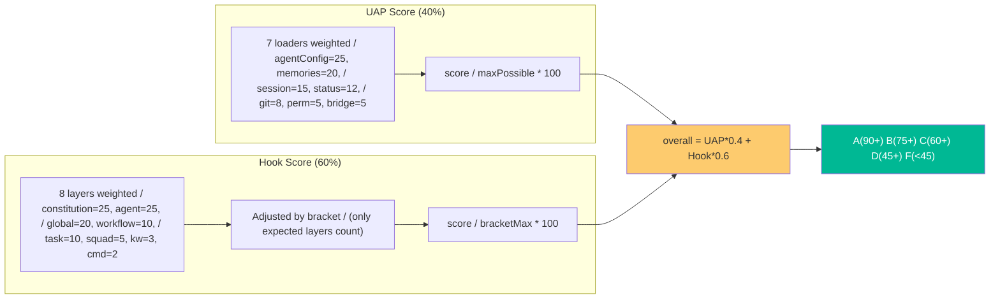

### Staleness & Degradation

| Condition | Threshold | Action |
|-----------|-----------|--------|
| Fresh data | &lt; 30 min | Score at 100% |
| Stale data | > 30 min | Score at 50% (degradation) |
| UAP stale (normal) | > 30 min after activation | Expected in long sessions |
| Hook stale | > 30 min since last prompt | Unusual — possible issue |

---

## 16. Metrics Persistence — UAP + Hook Pipeline

O SYNAPSE persiste metricas em `.synapse/metrics/` para consumo pelo diagnostico.
Ambos usam fire-and-forget (try/catch vazio) — nunca bloqueiam o pipeline principal.

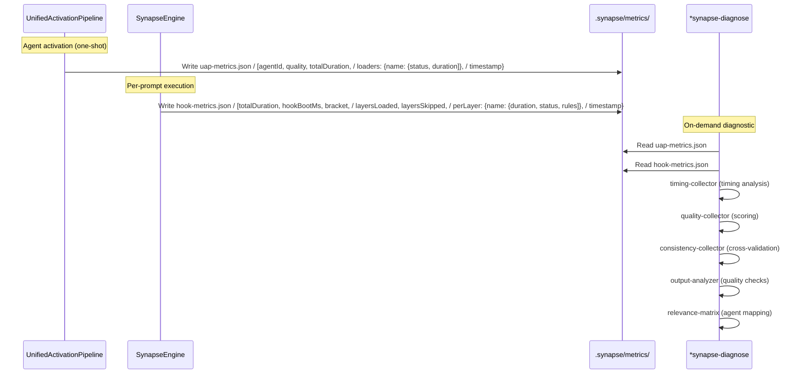

### uap-metrics.json Schema

```json
{
  "agentId": "dev",
  "quality": "full",
  "totalDuration": 145,
  "timestamp": "2026-02-14T15:09:10.762Z",
  "loaders": {
    "agentConfig": { "status": "ok", "duration": 45 },
    "permissionMode": { "status": "ok", "duration": 12 },
    "gitConfig": { "status": "ok", "duration": 8 },
    "sessionContext": { "status": "ok", "duration": 23 },
    "projectStatus": { "status": "timeout", "duration": 180 },
    "memories": { "status": "skipped", "duration": 0 },
    "synapseSession": { "status": "ok", "duration": 2 }
  }
}
```

### hook-metrics.json Schema

```json
{
  "totalDuration": 0.88,
  "hookBootMs": 12.5,
  "bracket": "FRESH",
  "layersLoaded": 3,
  "layersSkipped": 5,
  "layersErrored": 0,
  "totalRules": 70,
  "timestamp": "2026-02-14T19:07:47.723Z",
  "perLayer": {
    "constitution": { "duration": 0.3, "status": "ok", "rules": 34 },
    "global": { "duration": 0.2, "status": "ok", "rules": 25 },
    "agent": { "duration": 0.38, "status": "ok", "rules": 11 },
    "workflow": { "duration": 0, "status": "skipped", "rules": 0 }
  }
}
```

### Consistency Checks (4 validations)

| Check | What it validates | PASS condition |
|-------|-------------------|---------------|
| Bracket | Hook bracket is known value | FRESH/MODERATE/DEPLETED/CRITICAL |
| Agent | UAP agentId matches _active-agent.json | IDs match |
| Timestamp | UAP and Hook timestamps within 10 min | Gap &lt; 600s |
| Quality | UAP quality aligns with Hook layer count | full+layers or fallback |

---

*Documento gerado por @architect (Aria)*
*Baseado na implementacao real do codebase — nao especulativo*
*Atualizado: 2026-02-14 — SYN-14 Diagnostics v2*

— Aria, arquitetando o futuro 🏗️
