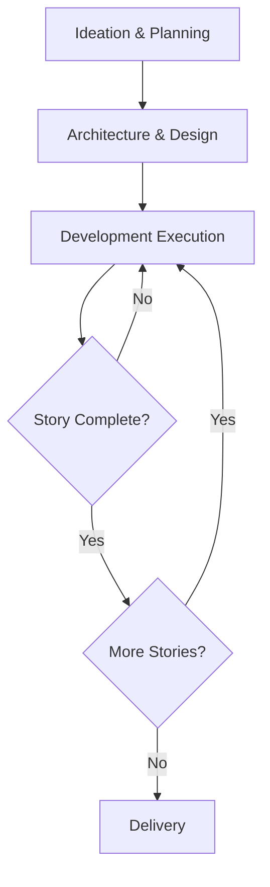
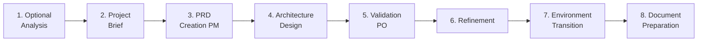
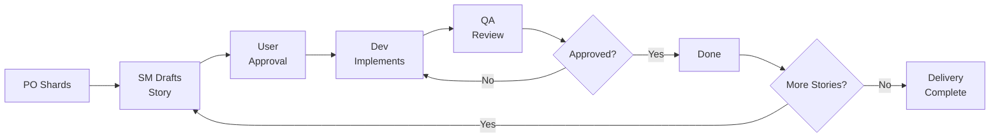

# System Architecture

The AIOS Method is a **meta-framework** that provides agentic modes, tasks, and templates for repeatable workflows. It operates as a layer on top of your development environment, facilitating the entire software lifecycle — from ideation to delivery.

## Overview

The framework operates across three major areas:

1. **Ideation & Planning** — Transform informal requirements into executable specifications
2. **Architecture & Design** — Define technical structure with specialized agents
3. **Development Execution** — Continuous SM → Dev → QA cycle until delivery

## Core Components

All components reside in the `aios-core/` directory and are organized as follows:

### Agents (`aios-core/agents/`)

Markdown files defining persona, capabilities, and dependencies for each agent. Each agent has a specific role in the workflow — from the Product Manager (`@pm`) who orchestrates epics to QA (`@qa`) who validates quality.

### Agent Teams (`aios-core/agent-teams/`)

Bundles of agents grouped for specific purposes. A team combines the agents needed to execute a complete workflow, such as the development team (SM + Dev + QA) or the planning team (PM + Architect + PO).

### Workflows (`aios-core/workflows/`)

YAML sequences of steps and agent interactions. They define execution order, entry/exit conditions, and decision points. The main workflows are:

- **Story Development Cycle (SDC)** — Full development cycle
- **QA Loop** — Iterative review-fix cycle
- **Spec Pipeline** — Pre-implementation specification pipeline
- **Brownfield Discovery** — Existing project assessment

### Reusable Resources

| Directory | Contents |
|-----------|----------|
| `templates/` | Document templates with placeholders |
| `tasks/` | Atomic task definitions with pre/post conditions |
| `checklists/` | Verification lists for quality gates |
| `data/` | Reference data and configurations |

## Template Processing System

AIOS features a three-layer template system:

- **template-format.md** — Markup language with `{{placeholders}}` for dynamic values and `[[LLM: instructions]]` for AI generation
- **create-doc.md** — Orchestration engine for document generation from templates
- **advanced-elicitation.md** — Interactive refinement layer that collects user information in a structured way

## Technical Preferences System

The `technical-preferences.md` file allows customizing agent behavior per project. It influences technology decisions, code patterns, and naming conventions across all agents participating in the project.

## Build & Delivery

AIOS supports two usage modes:

| Mode | How It Works |
|------|-------------|
| **IDE** | Direct use of agent markdown files in your editor |
| **Web UI** | Pre-built bundles from the `dist/` directory |

## Planning Workflow

Planning follows 8 sequential phases before development begins:

| Phase | Owner | Output |
|-------|-------|--------|
| 1. Analysis (optional) | Analyst | Analysis report |
| 2. Project Brief | User/PM | Briefing document |
| 3. PRD Creation | PM | Product Requirements Document |
| 4. Architecture Design | Architect | Architecture document |
| 5. Validation & Alignment | PO | Validated PRD |
| 6. Refinement | PM + PO | Refined PRD |
| 7. Environment Transition | DevOps | Web → IDE migration |
| 8. Document Preparation | PO | PRD shards for stories |

## Core Development Cycle

After planning, development follows a continuous, disciplined cycle:

1. **PO shards the PRD** into executable fragments
2. **SM drafts the story** from the shard
3. **User approves** the story draft
4. **Dev implements** with code self-healing (CodeRabbit)
5. **QA reviews** applying 7 quality checks
6. **Story complete** — cycle repeats for the next story

Each story passes through well-defined states: `Draft → Ready → InProgress → InReview → Done`.

## Architectural Principles

- **Task-First** — Workflows are composed of connected tasks, not connected agents
- **Agents as Executors** — Agents execute tasks, but the sequence and rules come from task definitions
- **Quality Gates** — Every state transition has automated verifications
- **IDS (Incremental Development System)** — REUSE {">"} ADAPT {">"} CREATE hierarchy to avoid duplication
- **Traceability** — Every artifact must be traceable to a documented requirement
