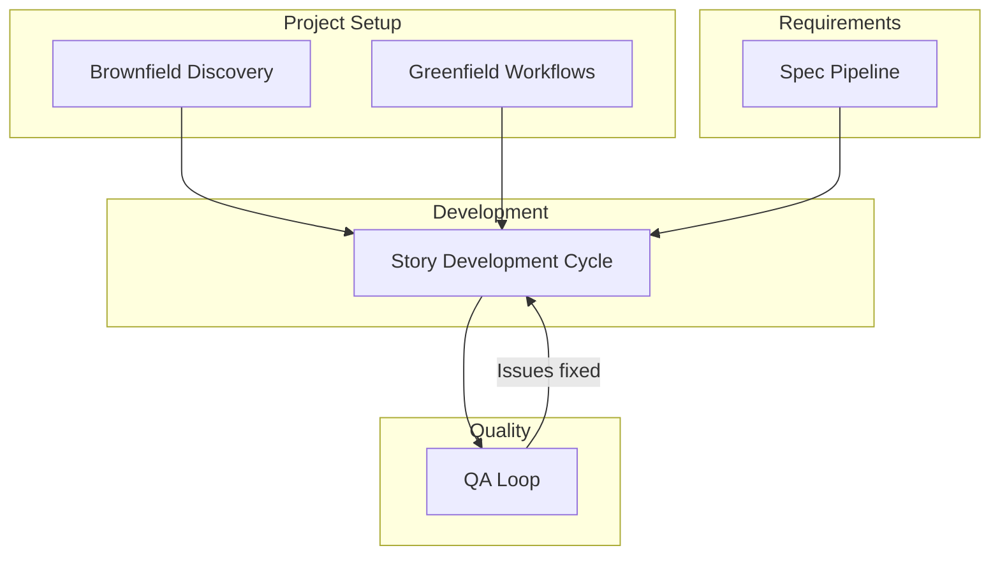

# Workflows -- Reference

AIOS provides a comprehensive set of workflows that orchestrate development from requirements to deployment. Each workflow automates agent coordination, quality gates, and artifact generation.

## Core Process Workflows

These workflows define the fundamental development processes used across all project types.

### [Story Development Cycle (SDC)](/en/docs/workflows/story-development-cycle)

The primary workflow for all development work. A 4-phase cycle that takes a story from creation through validation, implementation, and quality assurance.

**Agents involved:** @sm, @po, @dev, @qa, @devops

### [QA Loop](/en/docs/workflows/qa-loop)

Automated iterative review-fix cycle that runs after the initial QA gate. Orchestrates back-and-forth between @qa review and @dev fixes until the story is approved or escalated.

**Agents involved:** @qa, @dev

### [Spec Pipeline](/en/docs/workflows/spec-pipeline)

Transforms informal requirements into executable specifications through 6 adaptive phases. Produces validated specs with implementation plans, adapting depth based on detected complexity.

**Agents involved:** @pm, @architect, @analyst, @qa

## Project-Type Workflows

These workflows configure the development environment and process for specific project types.

### Greenfield Workflows

For new projects built from scratch:

| Workflow | Description |
|----------|-------------|
| Greenfield Fullstack | Full-stack applications (frontend + backend + database) |
| Greenfield Service | Backend/API services |
| Greenfield UI | Frontend-only applications |

### Brownfield Workflows

For existing projects and codebases:

| Workflow | Description |
|----------|-------------|
| Brownfield Discovery | 10-phase technical debt assessment for existing codebases |
| Brownfield Fullstack | Evolution of existing full-stack applications |
| Brownfield Service | Evolution of existing backend/API services |
| Brownfield UI | Evolution of existing frontend applications |

### Additional Workflows

| Workflow | Description |
|----------|-------------|
| Design System Build | Construction and quality assurance of design systems |
| Auto Worktree | Automatic git worktree management for parallel development |

## Workflow Selection Guide

| Situation | Recommended Workflow |
|-----------|---------------------|
| New story from an epic | Story Development Cycle |
| QA found issues after review | QA Loop |
| Complex feature needs formal spec | Spec Pipeline, then SDC |
| Joining an existing project | Brownfield Discovery |
| Simple bug fix | SDC (YOLO mode) |
| New project from scratch | Greenfield workflow (Fullstack/Service/UI) |
| Feature on existing codebase | Brownfield workflow (Fullstack/Service/UI) |
| Building a design system | Design System Build |

## How Workflows Connect

Workflows are designed to chain together. Here is the typical flow:

| From | To | Condition |
|------|----|-----------|
| Brownfield Discovery | Brownfield workflow | After assessment is complete |
| Greenfield workflow | Story Development Cycle | For each story in the epic |
| Brownfield workflow | Story Development Cycle | For each story in the epic |
| Spec Pipeline | Story Development Cycle | After spec is approved |
| Story Development Cycle | QA Loop | When QA gate returns FAIL |
| QA Loop | Story Development Cycle | When issues are fixed and approved |
