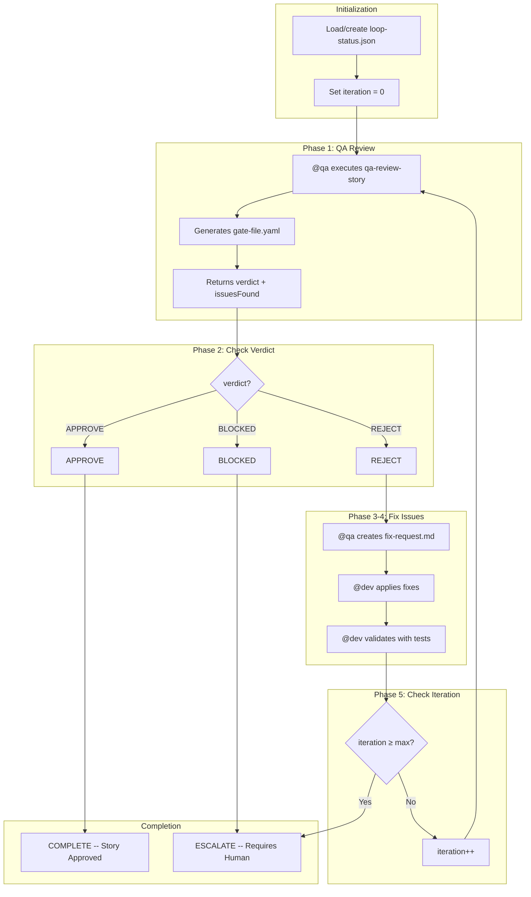

# QA Loop

Automated iterative review-fix cycle for quality improvement after the initial QA gate.

## Overview

The QA Loop orchestrates the complete cycle of **Review, Fix, Re-review** after the QA gate in the [Story Development Cycle](/en/docs/workflows/story-development-cycle) returns a FAIL verdict. It runs up to a configurable maximum of iterations (default: 5), tracking results at each iteration. When the limit is reached or a manual stop is requested, the workflow escalates for human intervention.

### Purpose

- Automate the quality review cycle between @qa and @dev
- Reduce time between feedback and correction
- Ensure full traceability of the QA process
- Escalate automatically when necessary

## How It Works



## Commands

| Command | Description |
|---------|-------------|
| `*qa-loop {storyId}` | Start full QA loop |
| `*qa-loop-review` | Start from the review step only |
| `*qa-loop-fix` | Start from the fix step only |
| `*stop-qa-loop` | Pause loop and save state |
| `*resume-qa-loop` | Resume from saved or escalated state |
| `*escalate-qa-loop` | Force manual escalation |
| `*qa-loop --reset` | Delete status file and restart |

## Loop Steps in Detail

### Step 1: QA Review

**Agent:** @qa (Quinn)
**Task:** `qa-review-story.md`
**Timeout:** 30 minutes

@qa performs a comprehensive review of the story implementation, running CodeRabbit in full self-healing mode (up to 3 iterations for CRITICAL/HIGH issues) before conducting manual analysis.

**Outputs:** `gate-file.yaml` with verdict and issue count

### Step 2: Check Verdict

The system evaluates the review verdict:

| Verdict | Action |
|---------|--------|
| **APPROVE** | Complete the loop, mark story as Done |
| **REJECT** | Continue to create fix request |
| **BLOCKED** | Escalate immediately to human |

### Step 3: Create Fix Request

**Agent:** @qa (Quinn)
**Task:** `qa-create-fix-request.md`

Generates a structured `QA_FIX_REQUEST.md` document from review findings, prioritizing issues and providing actionable fix instructions for @dev.

### Step 4: Apply Fixes

**Agent:** @dev (Dex)
**Task:** `dev-apply-qa-fixes.md`
**Timeout:** 60 minutes

@dev applies corrections based on the fix request, runs tests, and validates changes. Updates the story file and Dev Agent Record.

### Step 5: Check Iteration

The system increments the iteration counter and checks against the maximum. If the max is reached, it escalates to human intervention. Otherwise, the loop returns to Step 1.

## 7 Quality Checks

During each review iteration, @qa evaluates:

| # | Check | Description |
|---|-------|-------------|
| 1 | Code review | Patterns, readability, maintainability |
| 2 | Unit tests | Adequate coverage, all passing |
| 3 | Acceptance criteria | All criteria met per story AC |
| 4 | No regressions | Existing functionality preserved |
| 5 | Performance | Within acceptable limits |
| 6 | Security | OWASP basics verified |
| 7 | Documentation | Updated if necessary |

## Configuration

Key configuration options in `.aios-core/core-config.yaml`:

```yaml
autoClaude:
  qaLoop:
    maxIterations: 5       # Maximum review-fix iterations
    reviewTimeout: 1800000 # 30 minutes per review
    fixTimeout: 3600000    # 60 minutes per fix
```

**Status tracking file:** `qa/loop-status.json`

The status file records the full history of each iteration, including verdicts, issue counts, and timestamps.

## Escalation

### Triggers

The loop escalates automatically in these situations:

| Trigger | Description |
|---------|-------------|
| `max_iterations_reached` | Loop hit the maximum without APPROVE |
| `verdict_blocked` | @qa returned BLOCKED |
| `fix_failure` | @dev could not apply fixes after retries |
| `manual_escalate` | User ran `*escalate-qa-loop` |

### Escalation Context

When escalation occurs, the system provides a full context package:

- `loop-status.json` -- Complete loop status with history
- All gate files from each iteration
- All fix requests generated
- Summary of all iterations

### After Escalation

The user can:
1. Resume the loop: `*resume-qa-loop`
2. Manually fix and approve the story
3. Reject the story and create a follow-up

## CodeRabbit Integration

During the QA Loop, CodeRabbit operates in **full mode**:

```yaml
self_healing:
  type: full
  max_iterations: 3
  severity_filter: [CRITICAL, HIGH]
  behavior:
    CRITICAL: auto_fix
    HIGH: auto_fix
    MEDIUM: document_as_debt
    LOW: ignore
```

CodeRabbit self-healing runs as a pre-step before manual QA analysis in each review iteration. This ensures automated issues are resolved before the human-level architectural and traceability review.

## Stop and Resume

The QA Loop supports pausing and resuming at any point:

1. **Stop:** Run `*stop-qa-loop` to save the current state (status becomes `stopped`)
2. **Resume:** Run `*resume-qa-loop` to reload state and continue from where it left off

This is useful for taking breaks, consulting with team members, or waiting for external dependencies.
