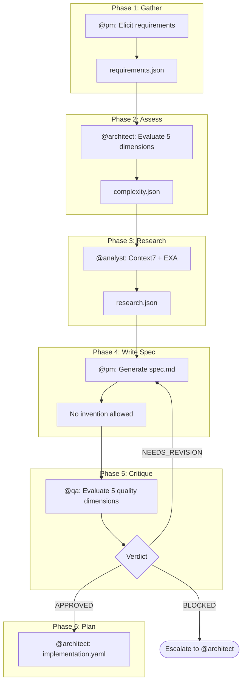
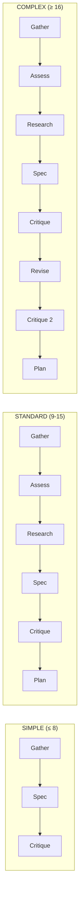

# Spec Pipeline

Transform informal requirements into executable specifications through an adaptive multi-phase workflow.

## Overview

The Spec Pipeline is an orchestrated workflow that transforms user descriptions into formal, structured specifications. It implements a flow of up to 6 phases that adapt dynamically based on the detected complexity of the requirement. The pipeline ensures quality through validation gates and enforces traceability from requirements to implementation.

### Fundamental Principles

| Principle | Description |
|-----------|-------------|
| **No Invention** | No fabricated information -- only derivation from inputs |
| **Traceability** | Every statement must trace to a requirement or research finding |
| **Adaptive Phases** | Phases adjust automatically based on complexity |
| **Quality Gates** | Mandatory validation before advancing |

## Pipeline Flow

## The 6 Phases

### Phase 1: Gather Requirements

**Agent:** @pm (Morgan)
**Task:** `spec-gather-requirements.md`

Interactive elicitation across 9 categories of questions:

1. **Functional** -- What should the system DO?
2. **Constraints** -- Technical or business restrictions?
3. **Non-Functional** -- Performance, security, scalability?
4. **Acceptance** -- Given/When/Then criteria?
5. **Assumptions** -- What is being assumed?
6. **Domain** -- Entities and relationships?
7. **Interaction** -- How does the user interact?
8. **Edge Cases** -- What can go wrong?
9. **Terminology** -- Domain-specific glossary?

**Output:** `requirements.json` with structured requirements (FR-\*, NFR-\*, CON-\*)

### Phase 2: Assess Complexity

**Agent:** @architect (Aria)
**Task:** `spec-assess-complexity.md`
**Skipped when:** `source=simple` or manual override to SIMPLE

Evaluates 5 dimensions of complexity, each scored 1-5:

| Dimension | Score 1 | Score 3 | Score 5 |
|-----------|---------|---------|---------|
| **Scope** | 1-2 files | 6-10 files | 20+ files |
| **Integration** | No external APIs | 1-2 external APIs | Multiple orchestrations |
| **Infrastructure** | No changes | New dependency | New infrastructure |
| **Knowledge** | Existing patterns | New library | Unknown domain |
| **Risk** | Low, isolated | Medium, important | Critical, core system |

**Output:** `complexity.json` with classification

### Phase 3: Research Dependencies

**Agent:** @analyst (Atlas)
**Task:** `spec-research-dependencies.md`
**Skipped when:** Complexity class is SIMPLE

Validates dependencies using Context7 (primary) and EXA (fallback). Checks the codebase for existing patterns, imports, and `package.json` entries.

**Output:** `research.json` with validated dependencies

### Phase 4: Write Specification

**Agent:** @pm (Morgan)
**Task:** `spec-write-spec.md`
**Constitutional Gate:** Article IV -- No Invention

Generates the formal specification document. Every statement MUST trace to a requirement (FR-\*, NFR-\*, CON-\*) or a verified research finding. Violations are blocked -- invented content is either removed or added to Open Questions.

**Output:** `spec.md` with full specification including architecture, data flow, testing strategy, and implementation checklist

### Phase 5: Critique Specification

**Agent:** @qa (Quinn)
**Task:** `spec-critique.md`

Evaluates the specification across 5 quality dimensions:

| Dimension | Weight | Verifies |
|-----------|--------|----------|
| **Accuracy** | 25% | Does spec correctly reflect requirements? |
| **Completeness** | 25% | All sections filled? Tests cover FRs? |
| **Consistency** | 20% | Valid IDs? No contradictions? |
| **Feasibility** | 15% | Technically possible? Dependencies exist? |
| **Alignment** | 15% | Aligned with project stack and patterns? |

**Output:** `critique.json` with verdict

### Phase 6: Create Implementation Plan

**Agent:** @architect (Aria)
**Task:** `plan-create-implementation.md`
**Condition:** Critique verdict is APPROVED

Generates an atomic implementation plan with subtasks:

| Rule | Description |
|------|-------------|
| Single Service | 1 service per subtask (frontend, backend, database, infra) |
| File Limit | Maximum 3 files per subtask |
| Verification Required | Each subtask MUST have defined verification |
| Dependency Order | Database, then Backend, then Frontend, then Integration |

**Output:** `implementation.yaml` with ordered subtasks

## Complexity Classes

The total complexity score determines which phases are active and how deep the pipeline goes:

| Score | Class | Active Phases | Estimated Time |
|-------|-------|---------------|----------------|
| ≤ 8 | **SIMPLE** | Gather, Spec, Critique (3 phases) | 30-60 min |
| 9-15 | **STANDARD** | All 6 phases | 2-4 hours |
| ≥ 16 | **COMPLEX** | 6 phases + Revise + Second Critique | 4-8 hours |

## Critique Verdicts

| Verdict | Condition | Next Action |
|---------|-----------|-------------|
| **APPROVED** | No HIGH issues, average score ≥ 4.0, all dimensions ≥ 3 | Proceed to Plan (Phase 6) |
| **NEEDS_REVISION** | MEDIUM issues or average score 3.0-3.9 | Return to Write Spec (Phase 4) |
| **BLOCKED** | HIGH issues or average score {'<'} 3.0 | Escalate to @architect |

## Constitutional Gate: Article IV -- No Invention

This is a strict enforcement rule applied during spec writing:

- Every statement in `spec.md` MUST trace to FR-\*, NFR-\*, CON-\*, or a verified research finding
- Adding features not listed in requirements is a **violation**
- Assuming details not validated by research is a **violation**
- Specifying technology not validated is a **violation**
- Creating invented acceptance criteria is a **violation**

On violation: the content is either **blocked and removed**, or moved to the **Open Questions** section for follow-up.

## Commands

| Command | Description | Agent |
|---------|-------------|-------|
| `*create-spec STORY-ID` | Run the full pipeline | -- |
| `*gather-requirements STORY-ID` | Run Gather phase only | @pm |
| `*assess-complexity STORY-ID` | Run Assess phase only | @architect |
| `*research-deps STORY-ID` | Run Research phase only | @analyst |
| `*write-spec STORY-ID` | Run Write phase only | @pm |
| `*critique-spec STORY-ID` | Run Critique phase only | @qa |

## Generated Artifacts

All artifacts are saved to `docs/stories/{storyId}/spec/`:

| Artifact | Phase | Description |
|----------|-------|-------------|
| `requirements.json` | 1 | Structured requirements across 9 categories |
| `complexity.json` | 2 | Complexity assessment with 5 dimensions |
| `research.json` | 3 | Validated dependencies and research findings |
| `spec.md` | 4 | Complete executable specification |
| `critique.json` | 5 | Quality evaluation result |
| `implementation.yaml` | 6 | Implementation plan with atomic subtasks |
