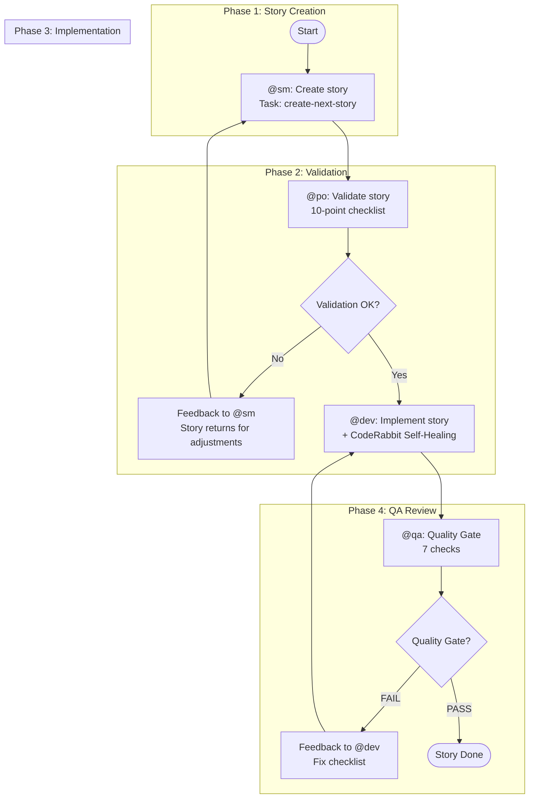
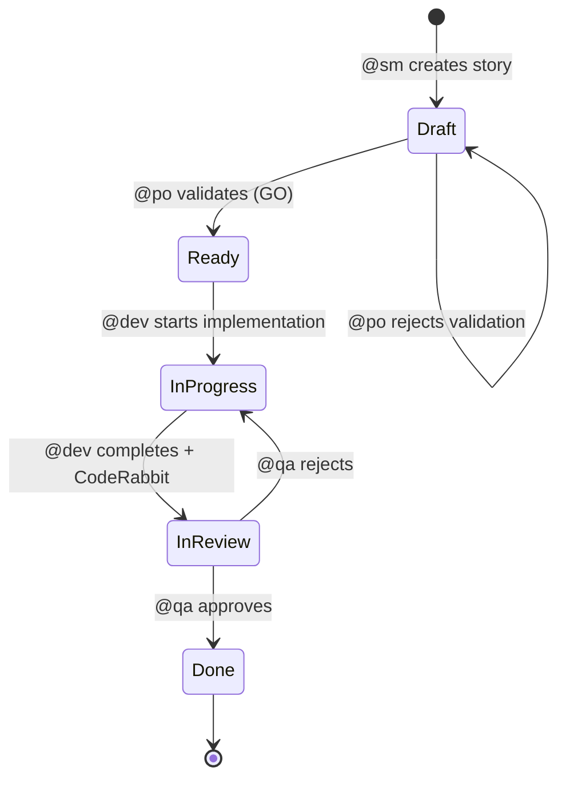

# Story Development Cycle

The primary workflow for all development work in AIOS. It automates the complete flow from story creation to delivery with integrated quality gates.

## Overview

The Story Development Cycle (SDC) is a 4-phase workflow that orchestrates the full lifecycle of a story: **Create, Validate, Implement, QA Gate**. Each phase is owned by a dedicated agent, and the story progresses through well-defined status transitions at each step.

### Supported Project Types

| Type | Description |
|------|-------------|
| `greenfield` | New projects from scratch |
| `brownfield` | Existing projects and maintenance |
| `feature-development` | New feature development |
| `bug-fix` | Bug fixes |
| `enhancement` | Improvements to existing features |

## Workflow Diagram

## Status Progression

The story status tracks its progress through the cycle:

| Status | Trigger | Agent |
|--------|---------|-------|
| Draft | Story created | @sm |
| Ready | Validation passes (GO) | @po |
| InProgress | Implementation starts | @dev |
| InReview | Implementation complete | @dev |
| Done | QA gate passes | @qa |

## Phase 1: Create (@sm)

**Agent:** @sm (River -- Scrum Master)
**Task:** `create-next-story.md`

The Scrum Master identifies and creates the next story from the backlog using the sharded PRD or project documentation as source.

**Inputs:**
- PRD (sharded or monolithic)
- Epic context from `docs/stories/epic-X/`

**Outputs:**
- Story file: `{epicNum}.{storyNum}.story.md`
- Status set to **Draft**

**Commands:**
- `*draft` -- Create next story
- `*story-checklist` -- Run story checklist

## Phase 2: Validate (@po)

**Agent:** @po (Pax -- Product Owner)
**Task:** `validate-next-story.md`

The Product Owner validates the story using a rigorous 10-point checklist. A score of 7 or higher results in GO; below 7 is NO-GO with required fixes.

### 10-Point Validation Checklist

| # | Check | Description |
|---|-------|-------------|
| 1 | Clear title | Title precisely describes what will be done |
| 2 | Complete description | Problem/need clearly explained |
| 3 | Testable acceptance criteria | Given/When/Then format preferred |
| 4 | Well-defined scope | IN and OUT clearly listed |
| 5 | Dependencies mapped | Prerequisite stories/resources identified |
| 6 | Complexity estimate | Story points or T-shirt sizing |
| 7 | Business value | Benefit to user/business is clear |
| 8 | Risks documented | Potential problems identified |
| 9 | Definition of Done | Clear completion criteria |
| 10 | PRD/Epic alignment | Consistency with source documents |

**Decision:**
- **GO** (score ≥ 7): Status changes from Draft to **Ready**
- **NO-GO** (score {'<'} 7): Returns to @sm with feedback

**Commands:**
- `*validate-story-draft {story}` -- Validate story quality

## Phase 3: Implement (@dev)

**Agent:** @dev (Dex -- Full Stack Developer)
**Task:** `dev-develop-story.md`

The developer implements the validated story following the acceptance criteria and defined tasks. Includes the CodeRabbit Self-Healing Loop for code quality.

### Execution Modes

| Mode | Description | User Prompts |
|------|-------------|-------------|
| **YOLO** | Autonomous execution with decision logging | 0-1 |
| **Interactive** | Decision checkpoints with educational feedback (default) | 5-10 |
| **Pre-Flight** | Complete planning before execution | 10-15 (upfront) |

### CodeRabbit Self-Healing

During implementation, CodeRabbit runs automated quality checks:

- **CRITICAL** issues: auto-fix (max 2 iterations)
- **HIGH** issues: auto-fix if iteration {'<'} 2, otherwise document as tech debt
- **MEDIUM** issues: document as tech debt
- **LOW** issues: ignore

If CRITICAL issues persist after 2 iterations, the workflow halts for manual intervention.

**Commands:**
- `*develop {story-id}` -- Implement story
- `*run-tests` -- Run linting and tests
- `*apply-qa-fixes` -- Apply QA fixes

## Phase 4: QA Gate (@qa)

**Agent:** @qa (Quinn -- Test Architect)
**Task:** `qa-gate.md`

The QA agent performs the final review with quality gate, validating code, tests, and adherence to acceptance criteria.

### 7 Quality Checks

| # | Check | Description |
|---|-------|-------------|
| 1 | Code review | Patterns, readability, maintainability |
| 2 | Unit tests | Adequate coverage, all passing |
| 3 | Acceptance criteria | All criteria met per story AC |
| 4 | No regressions | Existing functionality preserved |
| 5 | Performance | Within acceptable limits |
| 6 | Security | OWASP basics verified |
| 7 | Documentation | Updated if necessary |

### Gate Verdicts

| Verdict | Criteria | Action |
|---------|----------|--------|
| **PASS** | All checks pass, no HIGH issues | Approve story, hand to @devops |
| **CONCERNS** | Non-blocking issues present | Approve with documented observations |
| **FAIL** | HIGH/CRITICAL issues present | Return to @dev with feedback |
| **WAIVED** | Issues explicitly accepted | Approve with documented waiver |

**Commands:**
- `*review {story}` -- Comprehensive story review
- `*gate {story}` -- Create quality gate decision

## After QA

- **PASS/CONCERNS:** Story handed to @devops for `git push` and PR creation. Status set to **Done**.
- **FAIL:** The [QA Loop](/en/docs/workflows/qa-loop) engages for iterative fixes (max 5 iterations).

## Blocking Conditions

The workflow halts and requests user intervention when:

1. Unapproved dependencies are needed (new library or resource)
2. Ambiguity remains after checking the story
3. Three consecutive implementation or fix failures
4. Configuration is missing (`core-config.yaml` or templates)
5. Existing tests are broken (regression failure)
