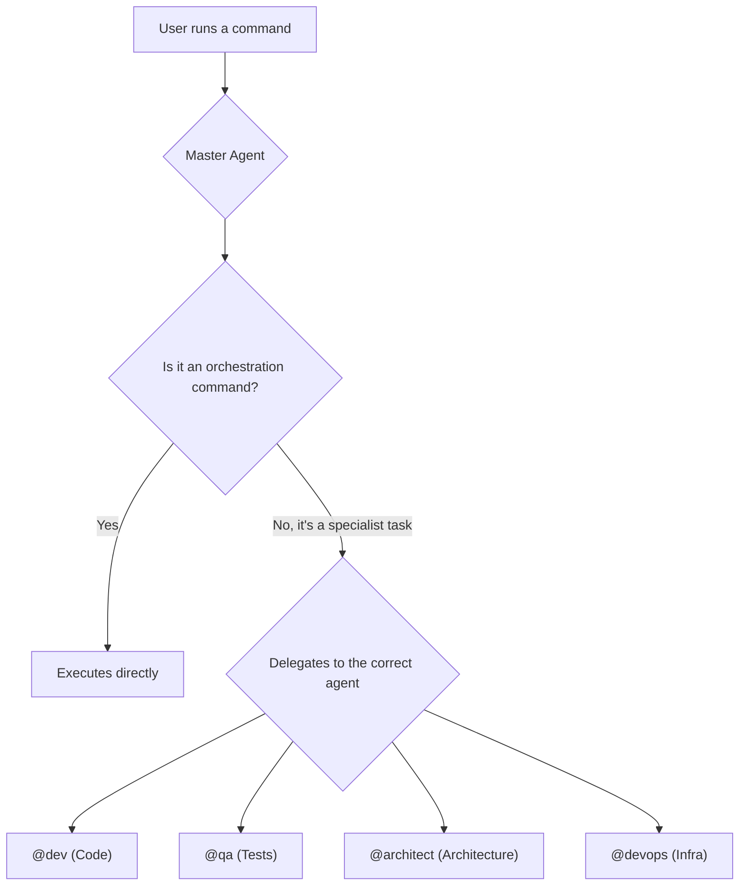

# Specialized and Delegated Commands

While the Master Agent acts as the orchestrator, many of the more granular and domain-specific tasks are delegated to specialist agents. This approach ensures that the right tool is used for each job, promoting a more modular and efficient system.

## The Principle of Delegation

The Master Agent (`@aios-master`) rarely performs implementation or deep analysis tasks directly. Instead, it invokes other agents that have the necessary knowledge and tools for the task.

For example, instead of the Master Agent knowing how to generate a test in React, it delegates this task to the `@dev` agent.



### How to Invoke Specialist Agents

You can interact with specialist agents in two ways:

1.  **Indirectly:** Through a Master Agent command that orchestrates a task. For example, `*run-workflow story-development-cycle` might invoke the `@sm`, `@dev`, and `@qa` agents in sequence.
2.  **Directly:** By activating the specialist agent and using its specific commands.

```bash
# Activate the development agent
*activate @dev

# Now, you can use @dev's specific commands
*generate-component UserProfile --type react --tests
```

## Categories of Specialized Commands

Detailed documentation for specialist agent commands will be found in the relevant sections of the `playbook` or in each agent's reference documentation.

Below is an overview of the command categories that are the responsibility of specialist agents:

### 👷 Code Generation (`@dev`)
- UI component generation (`*generate-component`)
- API endpoint creation (`*generate-api`)
- Business logic implementation

### 🧪 Testing and Quality (`@qa`)
- Test suite generation (`*generate-tests`)
- Execution of quality gates (`*qa-gate`)
- Review and correction loops (`*qa-loop`)

### 🏗️ Architecture (`@architect`)
- Generation of architecture diagrams
- Project structure analysis
- Large-scale refactoring suggestions

###  DevOps (`@devops`)
- Task scheduling (`*schedule-task`)
- Backup and restore operations (`*backup`, `*restore`)
- Deployment management (`*deploy`)

The full list of commands for each agent can be viewed using the `*help` command after activating the desired agent.
