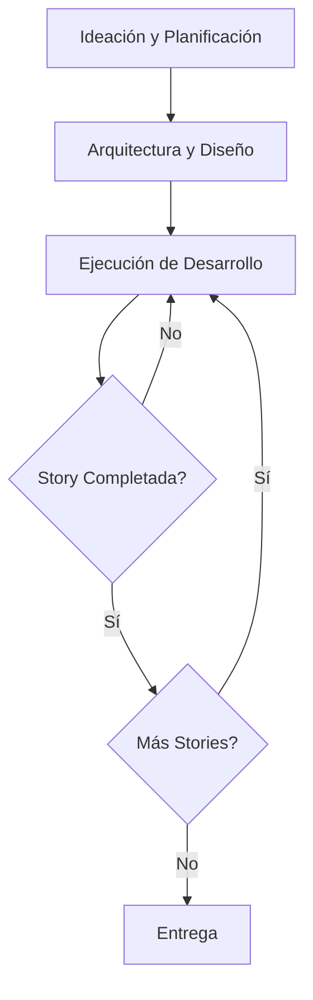
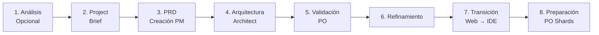
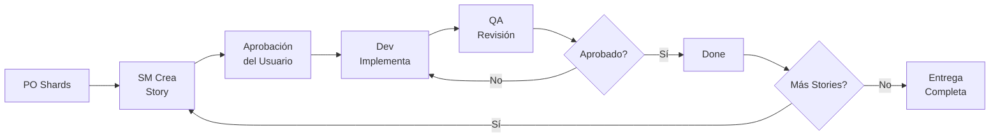

# Arquitectura del Sistema

El Método AIOS es un **meta-framework** que proporciona modos agénticos, tareas y plantillas para flujos de trabajo repetibles. Opera como una capa sobre tu entorno de desarrollo, facilitando todo el ciclo de vida del software — desde la ideación hasta la entrega.

## Visión General

El framework actúa en tres grandes áreas:

1. **Ideación y Planificación** — Transformar requisitos informales en especificaciones ejecutables
2. **Arquitectura y Diseño** — Definir la estructura técnica con agentes especializados
3. **Ejecución de Desarrollo** — Ciclo continuo SM → Dev → QA hasta la entrega

## Componentes Centrales

Todos los componentes residen en el directorio `aios-core/` y se organizan de la siguiente manera:

### Agentes (`aios-core/agents/`)

Archivos markdown que definen persona, capacidades y dependencias de cada agente. Cada agente tiene un rol específico en el flujo de trabajo — desde el Product Manager (`@pm`) que orquesta épicas hasta QA (`@qa`) que valida la calidad.

### Equipos de Agentes (`aios-core/agent-teams/`)

Paquetes de agentes agrupados para propósitos específicos. Un equipo combina los agentes necesarios para ejecutar un flujo de trabajo completo, como el equipo de desarrollo (SM + Dev + QA) o el equipo de planificación (PM + Architect + PO).

### Flujos de Trabajo (`aios-core/workflows/`)

Secuencias YAML de pasos e interacciones entre agentes. Definen el orden de ejecución, condiciones de entrada/salida y puntos de decisión. Los principales flujos de trabajo son:

- **Story Development Cycle (SDC)** — Ciclo completo de desarrollo
- **QA Loop** — Ciclo iterativo de revisión y corrección
- **Spec Pipeline** — Pipeline de especificación pre-implementación
- **Brownfield Discovery** — Evaluación de proyectos existentes

### Recursos Reutilizables

| Directorio | Contenido |
|------------|-----------|
| `templates/` | Plantillas de documentos con placeholders |
| `tasks/` | Definiciones de tareas atómicas con pre/post-condiciones |
| `checklists/` | Listas de verificación para puertas de calidad |
| `data/` | Datos de referencia y configuraciones |

## Sistema de Procesamiento de Plantillas

AIOS cuenta con un sistema de plantillas en tres capas:

- **template-format.md** — Lenguaje de marcado con `{{placeholders}}` para valores dinámicos y `[[LLM: instrucciones]]` para generación por IA
- **create-doc.md** — Motor de orquestación para generación de documentos a partir de plantillas
- **advanced-elicitation.md** — Capa de refinamiento interactivo que recopila información del usuario de forma estructurada

## Sistema de Preferencias Técnicas

El archivo `technical-preferences.md` permite personalizar el comportamiento de los agentes por proyecto. Influye en decisiones de tecnología, patrones de código y convenciones de nomenclatura en todos los agentes que participan en el proyecto.

## Build y Entrega

AIOS soporta dos modos de uso:

| Modo | Cómo Funciona |
|------|---------------|
| **IDE** | Uso directo de los archivos markdown de los agentes en tu editor |
| **Web UI** | Bundles preconstruidos desde el directorio `dist/` |

## Flujo de Trabajo de Planificación

La planificación sigue 8 fases secuenciales antes de que comience el desarrollo:

| Fase | Responsable | Salida |
|------|-------------|--------|
| 1. Análisis (opcional) | Analyst | Informe de análisis |
| 2. Project Brief | Usuario/PM | Documento de briefing |
| 3. Creación del PRD | PM | Product Requirements Document |
| 4. Diseño de Arquitectura | Architect | Documento de arquitectura |
| 5. Validación y Alineación | PO | PRD validado |
| 6. Refinamiento | PM + PO | PRD refinado |
| 7. Transición de Entorno | DevOps | Migración web → IDE |
| 8. Preparación de Documentos | PO | Shards del PRD para stories |

## Ciclo Central de Desarrollo

Después de la planificación, el desarrollo sigue un ciclo continuo y disciplinado:

1. **PO fragmenta el PRD** en shards ejecutables
2. **SM crea la story** a partir del shard
3. **Usuario aprueba** el borrador de la story
4. **Dev implementa** con auto-corrección de código (CodeRabbit)
5. **QA revisa** aplicando 7 verificaciones de calidad
6. **Story completada** — el ciclo se repite para la siguiente story

Cada story pasa por estados bien definidos: `Draft → Ready → InProgress → InReview → Done`.

## Principios Arquitectónicos

- **Task-First** — Los flujos de trabajo se componen de tareas conectadas, no de agentes conectados
- **Agentes como Ejecutores** — Los agentes ejecutan tareas, pero la secuencia y las reglas provienen de las definiciones de tasks
- **Puertas de Calidad** — Cada transición de estado tiene verificaciones automatizadas
- **IDS (Incremental Development System)** — Jerarquía REUSE {">"} ADAPT {">"} CREATE para evitar duplicación
- **Trazabilidad** — Todo artefacto debe ser rastreable hasta un requisito documentado
