# Guías de Plataformas

> 🌐 [EN](../../platforms/README.md) | **ES**

---

## Visión General de las Plataformas Soportadas

AIOS soporta 9 plataformas de desarrollo con IA. Elija la que mejor se adapte a su flujo de trabajo.

### Tabla Comparativa Rápida

| ------------------------ | :---------: | :------: | :------: | :------: | :-----: | :---------: | :--------: | :------: |
| **Activación de Agente** |  /comando   | @mención | @mención | @mención | 4 Modos |  Workflow   |   Modo   |   Prompt   | @mención |
| **Soporte MCP**          |   Nativo    |  Config  |  Config  | Limitado |   Sí    |   Nativo    |    No    |     No     | Limitado |
| **Tareas de Subagente**  |     Sí      |    No    |    No    |    No    |   Sí    |     Sí      |    No    |     No     |    No    |
| **Sync Automático**      |     Sí      |    Sí    |    Sí    |    Sí    |   Sí    |     Sí      |    Sí    |     Sí     |    Sí    |
| **Sistema de Hooks**     |     Sí      |    No    |    No    |    No    |   No    |     No      |    No    |     No     |    No    |
| **Skills/Comandos**      |   Nativo    |    No    |    No    |    No    |   No    |     No      |    No    |     No     |    No    |
| **Recomendación**        |   ⭐⭐⭐    |  ⭐⭐⭐  |   ⭐⭐   |   ⭐⭐   |  ⭐⭐   |    ⭐⭐     |    ⭐    |     ⭐     |    ⭐    |

### Guía de Decisión de Plataforma

```mermaid
flowchart TD
    Start["¿Qué plataforma / debo usar?"] --> Q1["¿Usas / Claude/Anthropic API?"]

    Q1 -->|Sí| CC["Claude Code ⭐ / Mejor integración AIOS"]
    Q1 -->|No| Q2["¿Prefieres / VS Code?"]

    Q2 -->|Sí| Q3["¿Quieres una / extensión?"]
    Q3 -->|No| Copilot["GitHub Copilot / Características nativas de GitHub"]

    Q2 -->|No| Q4["¿Quieres un / IDE dedicado con IA?"]
    Q4 -->|Sí| Q5["¿Qué modelo / prefieres?"]
    Q5 -->|Claude/GPT| Cursor["Cursor ⭐ / IDE con IA más popular"]

    Q4 -->|No| Q6["¿Usas Google Cloud?"]
    Q6 -->|Sí| AG["AntiGravity / Integración con Google"]

    style CC fill:#10b981,color:#fff
    style Cursor fill:#3b82f6,color:#fff
    style Copilot fill:#f59e0b,color:#fff
    style AG fill:#ef4444,color:#fff
    style Other fill:#6b7280,color:#fff
```



### Guías por Plataforma

| Prioridad | Plataforma         | Guía                                                                                                               | Descripción                                 |
| :-------: | ------------------ | ------------------------------------------------------------------------------------------------------------------ | ------------------------------------------- |
|  ⭐⭐⭐   | **Claude Code**    | [EN](../../platforms/claude-code.md) \| [PT](../../pt/platforms/claude-code.md) \| [ES](./claude-code.md)          | CLI oficial de Anthropic - **Recomendado**  |
|  ⭐⭐⭐   | **Cursor**         | [EN](../../platforms/cursor.md) \| [PT](../../pt/platforms/cursor.md) \| [ES](./cursor.md)                         | Editor de código AI-first con Composer      |
|    ⭐     | **GitHub Copilot** | [EN](../../platforms/github-copilot.md) \| [PT](../../pt/platforms/github-copilot.md) \| [ES](./github-copilot.md) | Programador par IA de GitHub                |
|   ⭐⭐    | **AntiGravity**    | [EN](../../platforms/antigravity.md) \| [PT](../../pt/platforms/antigravity.md) \| [ES](./antigravity.md)          | Plataforma de desarrollo agéntico de Google |
|    ⭐     | **Gemini CLI**     | [EN](../../platforms/gemini-cli.md) \| [PT](../../pt/platforms/gemini-cli.md) \| [ES](./gemini-cli.md)             | Asistente CLI de Google AI                  |

### Especificaciones Técnicas

<details>
<summary><b>Claude Code</b></summary>

```yaml
config_file: .claude/CLAUDE.md
agent_folder: .claude/commands/AIOS/agents
activation: /agent-name (comandos slash)
format: full-markdown-yaml
mcp_support: native
special_features:
  - Task tool para subagentes
  - Integración MCP nativa
  - Sistema de hooks (pre/post)
  - Skills personalizados
  - Persistencia de memoria
```

</details>

<details>
<summary><b>Cursor</b></summary>

```yaml
config_file: .cursor/rules.md
agent_folder: .cursor/rules
activation: @agent-name
format: condensed-rules
mcp_support: via configuration
special_features:
  - Integración con Composer
  - Modos de chat
  - Contexto @codebase
  - Edición multi-archivo
```

</details>

<details>

```yaml
activation: @agent-name
format: xml-tagged-markdown
mcp_support: via configuration
special_features:
  - Cascade flow
  - Supercomplete
  - Sistema de Flows
```

</details>

<details>

```yaml
activation: @agent-name
format: condensed-rules
mcp_support: limited
special_features:
  - Integración con VS Code
  - Ecosistema de extensiones
  - Sugerencias inline
```

</details>

<details>
<summary><b>GitHub Copilot</b></summary>

```yaml
config_file: .github/copilot-instructions.md
agent_folder: .github/agents
activation: modos de chat
format: text
mcp_support: none
special_features:
  - Integración con GitHub
  - Asistencia en PR
  - Revisión de código
```

</details>

<details>
<summary><b>AntiGravity</b></summary>

```yaml
config_file: .antigravity/rules.md
config_json: .antigravity/antigravity.json
agent_folder: .agent/workflows
activation: workflow-based
format: cursor-style
mcp_support: native (Google)
special_features:
  - Integración con Google Cloud
  - Sistema de workflows
  - Herramientas Firebase nativas
```

</details>

<details>

<details>
<summary><b>Gemini CLI</b></summary>

```yaml
config_file: .gemini/rules.md
agent_folder: .gemini/agents
activation: mención en prompt
format: text
mcp_support: none
special_features:
  - Modelos Google AI
  - Flujo de trabajo basado en CLI
  - Soporte multimodal
```

</details>

<details>

```yaml
activation: @agent-name
format: project-rules
mcp_support: limited
special_features:
  - UI moderna
  - Iteración rápida
  - Modo Builder
```

</details>

### Arquitectura de Integración

```mermaid
graph TD
    subgraph "AIOS Core"
        Agents["Definiciones de Agentes / .aios-core/development/agents"]
        Templates["Templates de IDE / .aios-core/product/templates"]
        Sync["Sistema de Sync / scripts ide-sync"]
    end

    subgraph "Integraciones de IDE"
        CC[".claude/"]
        CU[".cursor/"]
        GH[".github/"]
        AG[".antigravity/"]        GE[".gemini/"]
    end

    Agents --> Sync
    Templates --> Sync
    Sync --> CC
    Sync --> CU
    Sync --> WS
    Sync --> CL
    Sync --> GH
    Sync --> AG
    Sync --> RO
    Sync --> GE
    Sync --> TR
```

### Inicio Rápido

1. **Instale AIOS** en su proyecto:

   ```bash
   npx @anthropic/aios init
   ```

2. **Seleccione su(s) IDE(s)** durante la configuración

3. **Sincronice los agentes** a su plataforma:

   ```bash
   npm run sync:ide
   ```

4. **Comience a usar los agentes** con la activación específica de la plataforma

---

## Flujo de Sincronización de Agentes

```mermaid
sequenceDiagram
    participant User as Usuario
    participant CLI as AIOS CLI
    participant Parser as Agent Parser
    participant Transform as IDE Transformer
    participant IDE as IDE Config

    User->>CLI: npm run sync:ide
    CLI->>Parser: Cargar definiciones de agentes
    Parser->>Parser: Parsear frontmatter YAML
    Parser->>Transform: Enviar agentes parseados

    loop Para cada IDE seleccionado
        Transform->>Transform: Aplicar formato específico del IDE
        Transform->>IDE: Escribir archivos de configuración
    end

    IDE-->>User: Agentes listos para usar
```



---

## Migración

¿Necesita cambiar de plataforma? Cada guía incluye instrucciones de migración:

- **Desde** otro IDE hacia su destino
- **Hacia** otro IDE desde su actual

---

_Synkra AIOS - Documentación de Plataformas v1.0_
