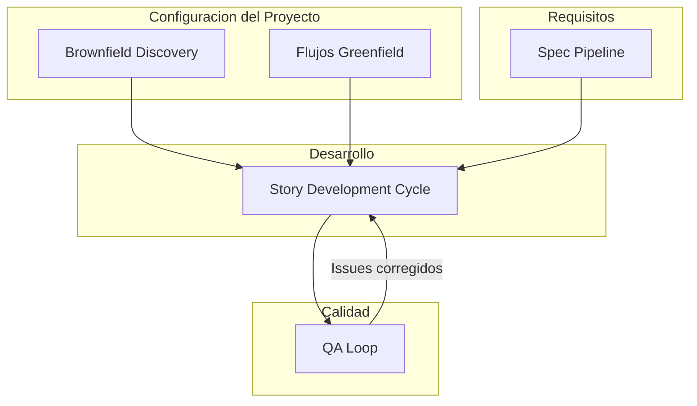

# Flujos de Trabajo -- Referencia

AIOS proporciona un conjunto completo de flujos de trabajo que orquestan el desarrollo desde los requisitos hasta el despliegue. Cada flujo de trabajo automatiza la coordinacion entre agentes, quality gates y generacion de artefactos.

## Flujos de Trabajo de Proceso

Estos flujos de trabajo definen los procesos fundamentales de desarrollo utilizados en todos los tipos de proyecto.

### [Story Development Cycle (SDC)](/es/docs/workflows/story-development-cycle)

El flujo de trabajo principal para todo el trabajo de desarrollo. Un ciclo de 4 fases que lleva una historia desde la creacion, pasando por la validacion, implementacion y aseguramiento de calidad.

**Agentes involucrados:** @sm, @po, @dev, @qa, @devops

### [QA Loop](/es/docs/workflows/qa-loop)

Ciclo automatizado e iterativo de revision y correccion que se ejecuta despues del QA gate inicial. Orquesta el intercambio entre la revision de @qa y las correcciones de @dev hasta que la historia sea aprobada o escalada.

**Agentes involucrados:** @qa, @dev

### [Spec Pipeline](/es/docs/workflows/spec-pipeline)

Transforma requisitos informales en especificaciones ejecutables a traves de 6 fases adaptativas. Produce especificaciones validadas con planes de implementacion, adaptando la profundidad segun la complejidad detectada.

**Agentes involucrados:** @pm, @architect, @analyst, @qa

## Flujos de Trabajo por Tipo de Proyecto

Estos flujos de trabajo configuran el entorno y el proceso de desarrollo para tipos especificos de proyecto.

### Flujos de Trabajo Greenfield

Para proyectos nuevos, desde cero:

| Flujo de Trabajo | Descripcion |
|-----------------|-------------|
| Greenfield Fullstack | Aplicaciones full-stack (frontend + backend + base de datos) |
| Greenfield Service | Servicios backend/API |
| Greenfield UI | Aplicaciones solo frontend |

### Flujos de Trabajo Brownfield

Para proyectos y codebases existentes:

| Flujo de Trabajo | Descripcion |
|-----------------|-------------|
| Brownfield Discovery | Evaluacion de deuda tecnica en 10 fases para codebases existentes |
| Brownfield Fullstack | Evolucion de aplicaciones full-stack existentes |
| Brownfield Service | Evolucion de servicios backend/API existentes |
| Brownfield UI | Evolucion de aplicaciones frontend existentes |

### Flujos de Trabajo Adicionales

| Flujo de Trabajo | Descripcion |
|-----------------|-------------|
| Design System Build | Construccion y aseguramiento de calidad de design systems |
| Auto Worktree | Gestion automatica de git worktrees para desarrollo paralelo |

## Guia de Seleccion de Flujo de Trabajo

| Situacion | Flujo de Trabajo Recomendado |
|-----------|------------------------------|
| Nueva historia desde un epic | Story Development Cycle |
| QA encontro problemas despues de la revision | QA Loop |
| Feature compleja necesita especificacion formal | Spec Pipeline, luego SDC |
| Unirse a un proyecto existente | Brownfield Discovery |
| Correccion simple de error | SDC (modo YOLO) |
| Nuevo proyecto desde cero | Flujo Greenfield (Fullstack/Service/UI) |
| Feature en codebase existente | Flujo Brownfield (Fullstack/Service/UI) |
| Construyendo un design system | Design System Build |

## Como se Conectan los Flujos de Trabajo

Los flujos de trabajo estan disenados para encadenarse. Este es el flujo tipico:

| Desde | Hacia | Condicion |
|-------|-------|-----------|
| Brownfield Discovery | Flujo Brownfield | Despues de completar la evaluacion |
| Flujo Greenfield | Story Development Cycle | Para cada historia del epic |
| Flujo Brownfield | Story Development Cycle | Para cada historia del epic |
| Spec Pipeline | Story Development Cycle | Despues de que la especificacion sea aprobada |
| Story Development Cycle | QA Loop | Cuando el QA gate retorna FAIL |
| QA Loop | Story Development Cycle | Cuando los issues se corrigen y aprueban |
