# Bucle QA

Ciclo automatizado e iterativo de revision y correccion para mejora de calidad despues del QA gate inicial.

## Resumen

El QA Loop orquesta el ciclo completo de **Review, Fix, Re-review** despues de que el QA gate en el [Story Development Cycle](/es/docs/workflows/story-development-cycle) retorna un veredicto FAIL. Se ejecuta hasta un maximo configurable de iteraciones (predeterminado: 5), rastreando los resultados de cada iteracion. Cuando se alcanza el limite o se solicita una parada manual, el flujo de trabajo escala a intervencion humana.

### Proposito

- Automatizar el ciclo de revision de calidad entre @qa y @dev
- Reducir el tiempo entre feedback y correccion
- Garantizar trazabilidad completa del proceso de QA
- Escalar automaticamente cuando sea necesario

## Como Funciona

```mermaid
flowchart TD
    subgraph INIT["Inicializacion"]
        I1["Cargar/crear loop-status.json"]
        I2["Definir iteration = 0"]
    end

    subgraph REVIEW["Fase 1: Revision QA"]
        R1["@qa ejecuta qa-review-story"]
        R2["Genera gate-file.yaml"]
        R3["Retorna verdict + issuesFound"]
    end

    subgraph CHECK["Fase 2: Verificar Veredicto"]
        C1{"verdict?"}
        APPROVE["APPROVE"]
        BLOCKED["BLOCKED"]
        REJECT["REJECT"]
    end

    subgraph FIX["Fase 3-4: Corregir Issues"]
        F1["@qa crea fix-request.md"]
        F2["@dev aplica correcciones"]
        F3["@dev valida con pruebas"]
    end

    subgraph ITER["Fase 5: Verificar Iteracion"]
        IT1{"iteration ≥ max?"}
        IT2["iteration++"]
    end

    subgraph END["Finalizacion"]
        E1["COMPLETE -- Historia Aprobada"]
        E2["ESCALATE -- Requiere Humano"]
    end

    I1 --> I2 --> R1
    R1 --> R2 --> R3 --> C1
    C1 -->|"APPROVE"| APPROVE --> E1
    C1 -->|"BLOCKED"| BLOCKED --> E2
    C1 -->|"REJECT"| REJECT --> F1
    F1 --> F2 --> F3 --> IT1
    IT1 -->|"Si"| E2
    IT1 -->|"No"| IT2 --> R1
```



## Comandos

| Comando | Descripcion |
|---------|-------------|
| `*qa-loop {storyId}` | Iniciar QA loop completo |
| `*qa-loop-review` | Iniciar solo desde el paso de revision |
| `*qa-loop-fix` | Iniciar solo desde el paso de correccion |
| `*stop-qa-loop` | Pausar loop y guardar estado |
| `*resume-qa-loop` | Reanudar desde estado guardado o escalado |
| `*escalate-qa-loop` | Forzar escalada manual |
| `*qa-loop --reset` | Eliminar archivo de estado y reiniciar |

## Pasos en Detalle

### Paso 1: Revision QA

**Agente:** @qa (Quinn)
**Task:** `qa-review-story.md`
**Timeout:** 30 minutos

@qa realiza una revision integral de la implementacion de la historia, ejecutando CodeRabbit en modo completo de self-healing (hasta 3 iteraciones para issues CRITICAL/HIGH) antes de realizar el analisis manual.

**Salidas:** `gate-file.yaml` con veredicto y conteo de issues

### Paso 2: Verificar Veredicto

El sistema evalua el veredicto de la revision:

| Veredicto | Accion |
|-----------|--------|
| **APPROVE** | Completar el loop, marcar historia como Done |
| **REJECT** | Continuar para crear solicitud de correccion |
| **BLOCKED** | Escalar inmediatamente a humano |

### Paso 3: Crear Solicitud de Correccion

**Agente:** @qa (Quinn)
**Task:** `qa-create-fix-request.md`

Genera un documento estructurado `QA_FIX_REQUEST.md` a partir de los hallazgos de la revision, priorizando issues y proporcionando instrucciones accionables de correccion para @dev.

### Paso 4: Aplicar Correcciones

**Agente:** @dev (Dex)
**Task:** `dev-apply-qa-fixes.md`
**Timeout:** 60 minutos

@dev aplica las correcciones basadas en la solicitud de correccion, ejecuta pruebas y valida los cambios. Actualiza el archivo de la historia y el Dev Agent Record.

### Paso 5: Verificar Iteracion

El sistema incrementa el contador de iteracion y lo verifica contra el maximo. Si se alcanza el maximo, escala a intervencion humana. De lo contrario, el loop vuelve al Paso 1.

## 7 Verificaciones de Calidad

En cada iteracion de revision, @qa evalua:

| # | Verificacion | Descripcion |
|---|-------------|-------------|
| 1 | Code review | Patrones, legibilidad, mantenibilidad |
| 2 | Pruebas unitarias | Cobertura adecuada, todas pasando |
| 3 | Criterios de aceptacion | Todos cumplidos segun story AC |
| 4 | Sin regresiones | Funcionalidades existentes preservadas |
| 5 | Rendimiento | Dentro de los limites aceptables |
| 6 | Seguridad | OWASP basics verificados |
| 7 | Documentacion | Actualizada si es necesario |

## Configuracion

Opciones principales de configuracion en `.aios-core/core-config.yaml`:

```yaml
autoClaude:
  qaLoop:
    maxIterations: 5       # Maximo de iteraciones revision-correccion
    reviewTimeout: 1800000 # 30 minutos por revision
    fixTimeout: 3600000    # 60 minutos por correccion
```

**Archivo de seguimiento de estado:** `qa/loop-status.json`

El archivo de estado registra el historial completo de cada iteracion, incluyendo veredictos, conteo de issues y marcas de tiempo.

## Escalada

### Disparadores

El loop se escala automaticamente en estas situaciones:

| Disparador | Descripcion |
|-----------|-------------|
| `max_iterations_reached` | Loop alcanzo el maximo sin APPROVE |
| `verdict_blocked` | @qa retorno BLOCKED |
| `fix_failure` | @dev no pudo aplicar correcciones despues de reintentos |
| `manual_escalate` | Usuario ejecuto `*escalate-qa-loop` |

### Contexto de Escalada

Cuando ocurre una escalada, el sistema proporciona un paquete completo de contexto:

- `loop-status.json` -- Estado completo del loop con historial
- Todos los gate files de cada iteracion
- Todas las solicitudes de correccion generadas
- Resumen de todas las iteraciones

### Despues de la Escalada

El usuario puede:
1. Reanudar el loop: `*resume-qa-loop`
2. Corregir manualmente y aprobar la historia
3. Rechazar la historia y crear un seguimiento

## Integracion con CodeRabbit

Durante el QA Loop, CodeRabbit opera en **modo completo**:

```yaml
self_healing:
  type: full
  max_iterations: 3
  severity_filter: [CRITICAL, HIGH]
  behavior:
    CRITICAL: auto_fix
    HIGH: auto_fix
    MEDIUM: document_as_debt
    LOW: ignore
```

El self-healing de CodeRabbit se ejecuta como paso previo antes del analisis manual de QA en cada iteracion de revision. Esto asegura que los issues automatizados se resuelvan antes de la revision a nivel arquitectural y de trazabilidad.

## Detener y Reanudar

El QA Loop soporta pausa y reanudacion en cualquier momento:

1. **Detener:** Ejecute `*stop-qa-loop` para guardar el estado actual (estado se vuelve `stopped`)
2. **Reanudar:** Ejecute `*resume-qa-loop` para recargar el estado y continuar donde se detuvo

Esto es util para pausas, consultas con miembros del equipo o esperar dependencias externas.
