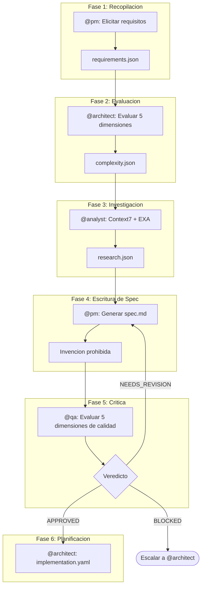
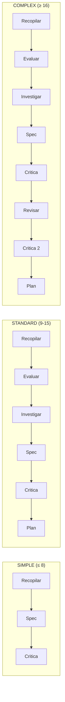

# Canalizacion de Especificaciones

Transforma requisitos informales en especificaciones ejecutables a traves de un flujo de trabajo adaptativo de multiples fases.

## Resumen

El Spec Pipeline es un flujo de trabajo orquestado que transforma descripciones de usuarios en especificaciones formales y estructuradas. Implementa un flujo de hasta 6 fases que se adaptan dinamicamente segun la complejidad detectada del requisito. El pipeline garantiza calidad a traves de gates de validacion y refuerza la trazabilidad desde los requisitos hasta la implementacion.

### Principios Fundamentales

| Principio | Descripcion |
|-----------|-------------|
| **No Invention** | Ninguna informacion fabricada -- solo derivacion de los inputs |
| **Traceability** | Toda declaracion debe rastrearse a un requisito o hallazgo de investigacion |
| **Adaptive Phases** | Las fases se ajustan automaticamente segun la complejidad |
| **Quality Gates** | Validacion obligatoria antes de avanzar |

## Flujo del Pipeline

## Las 6 Fases

### Fase 1: Recopilar Requisitos

**Agente:** @pm (Morgan)
**Task:** `spec-gather-requirements.md`

Elicitacion interactiva en 9 categorias de preguntas:

1. **Funcionales** -- Que debe HACER el sistema?
2. **Restricciones** -- Restricciones tecnicas o de negocio?
3. **No-Funcionales** -- Rendimiento, seguridad, escalabilidad?
4. **Aceptacion** -- Criterios Given/When/Then?
5. **Suposiciones** -- Que se esta asumiendo?
6. **Dominio** -- Entidades y relaciones?
7. **Interaccion** -- Como interactua el usuario?
8. **Casos Extremos** -- Que puede salir mal?
9. **Terminologia** -- Glosario especifico del dominio?

**Salida:** `requirements.json` con requisitos estructurados (FR-\*, NFR-\*, CON-\*)

### Fase 2: Evaluar Complejidad

**Agente:** @architect (Aria)
**Task:** `spec-assess-complexity.md`
**Se omite cuando:** `source=simple` o anulacion manual a SIMPLE

Evalua 5 dimensiones de complejidad, cada una puntuada de 1 a 5:

| Dimension | Score 1 | Score 3 | Score 5 |
|-----------|---------|---------|---------|
| **Alcance** | 1-2 archivos | 6-10 archivos | 20+ archivos |
| **Integracion** | Sin APIs externas | 1-2 APIs externas | Multiples orquestaciones |
| **Infraestructura** | Sin cambios | Nueva dependencia | Nueva infraestructura |
| **Conocimiento** | Patrones existentes | Nueva biblioteca | Dominio desconocido |
| **Riesgo** | Bajo, aislado | Medio, importante | Critico, nucleo del sistema |

**Salida:** `complexity.json` con clasificacion

### Fase 3: Investigar Dependencias

**Agente:** @analyst (Atlas)
**Task:** `spec-research-dependencies.md`
**Se omite cuando:** La clase de complejidad es SIMPLE

Valida dependencias usando Context7 (primario) y EXA (fallback). Verifica la codebase en busca de patrones existentes, imports y entradas en `package.json`.

**Salida:** `research.json` con dependencias validadas

### Fase 4: Escribir Especificacion

**Agente:** @pm (Morgan)
**Task:** `spec-write-spec.md`
**Gate Constitucional:** Articulo IV -- Prohibicion de Invencion

Genera el documento formal de especificacion. Toda declaracion DEBE rastrearse a un requisito (FR-\*, NFR-\*, CON-\*) o un hallazgo de investigacion verificado. Las violaciones se bloquean -- el contenido inventado se elimina o se agrega a Open Questions.

**Salida:** `spec.md` con especificacion completa incluyendo arquitectura, flujo de datos, estrategia de pruebas y lista de verificacion de implementacion

### Fase 5: Criticar Especificacion

**Agente:** @qa (Quinn)
**Task:** `spec-critique.md`

Evalua la especificacion en 5 dimensiones de calidad:

| Dimension | Peso | Verifica |
|-----------|------|----------|
| **Precision** | 25% | La especificacion refleja correctamente los requisitos? |
| **Completitud** | 25% | Todas las secciones completas? Las pruebas cubren FRs? |
| **Consistencia** | 20% | IDs validos? Sin contradicciones? |
| **Viabilidad** | 15% | Tecnicamente posible? Las dependencias existen? |
| **Alineacion** | 15% | Alineado con stack y patrones del proyecto? |

**Salida:** `critique.json` con veredicto

### Fase 6: Crear Plan de Implementacion

**Agente:** @architect (Aria)
**Task:** `plan-create-implementation.md`
**Condicion:** El veredicto de la critica es APPROVED

Genera un plan de implementacion atomico con subtareas:

| Regla | Descripcion |
|-------|-------------|
| Servicio Unico | 1 servicio por subtarea (frontend, backend, base de datos, infra) |
| Limite de Archivos | Maximo 3 archivos por subtarea |
| Verificacion Obligatoria | Cada subtarea DEBE tener verificacion definida |
| Orden de Dependencias | Base de Datos, luego Backend, luego Frontend, luego Integracion |

**Salida:** `implementation.yaml` con subtareas ordenadas

## Clases de Complejidad

La puntuacion total de complejidad determina cuales fases estan activas y la profundidad del pipeline:

| Puntuacion | Clase | Fases Activas | Tiempo Estimado |
|-----------|-------|---------------|----------------|
| ≤ 8 | **SIMPLE** | Recopilacion, Spec, Critica (3 fases) | 30-60 min |
| 9-15 | **STANDARD** | Las 6 fases | 2-4 horas |
| ≥ 16 | **COMPLEX** | 6 fases + Revision + Segunda Critica | 4-8 horas |

## Veredictos de la Critica

| Veredicto | Condicion | Proxima Accion |
|-----------|-----------|----------------|
| **APPROVED** | Sin issues HIGH, promedio ≥ 4.0, todas dimensiones ≥ 3 | Proceder al Plan (Fase 6) |
| **NEEDS_REVISION** | Issues MEDIUM o promedio 3.0-3.9 | Volver a Escritura de Spec (Fase 4) |
| **BLOCKED** | Issues HIGH o promedio {'<'} 3.0 | Escalar a @architect |

## Gate Constitucional: Articulo IV -- Prohibicion de Invencion

Esta es una regla de aplicacion estricta durante la escritura de la especificacion:

- Toda declaracion en `spec.md` DEBE rastrearse a FR-\*, NFR-\*, CON-\* o un hallazgo de investigacion verificado
- Agregar funcionalidades no listadas en los requisitos es una **violacion**
- Asumir detalles no validados por la investigacion es una **violacion**
- Especificar tecnologia no validada es una **violacion**
- Crear criterios de aceptacion inventados es una **violacion**

En caso de violacion: el contenido se **bloquea y elimina**, o se mueve a la seccion **Open Questions** para seguimiento.

## Comandos

| Comando | Descripcion | Agente |
|---------|-------------|--------|
| `*create-spec STORY-ID` | Ejecutar pipeline completo | -- |
| `*gather-requirements STORY-ID` | Ejecutar solo fase Recopilacion | @pm |
| `*assess-complexity STORY-ID` | Ejecutar solo fase Evaluacion | @architect |
| `*research-deps STORY-ID` | Ejecutar solo fase Investigacion | @analyst |
| `*write-spec STORY-ID` | Ejecutar solo fase Escritura | @pm |
| `*critique-spec STORY-ID` | Ejecutar solo fase Critica | @qa |

## Artefactos Generados

Todos los artefactos se guardan en `docs/stories/{storyId}/spec/`:

| Artefacto | Fase | Descripcion |
|-----------|------|-------------|
| `requirements.json` | 1 | Requisitos estructurados en 9 categorias |
| `complexity.json` | 2 | Evaluacion de complejidad con 5 dimensiones |
| `research.json` | 3 | Dependencias validadas y hallazgos de investigacion |
| `spec.md` | 4 | Especificacion ejecutable completa |
| `critique.json` | 5 | Resultado de la evaluacion de calidad |
| `implementation.yaml` | 6 | Plan de implementacion con subtareas atomicas |
