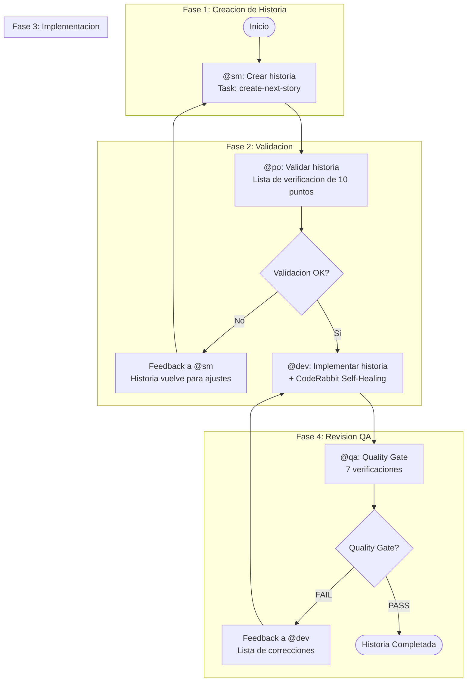
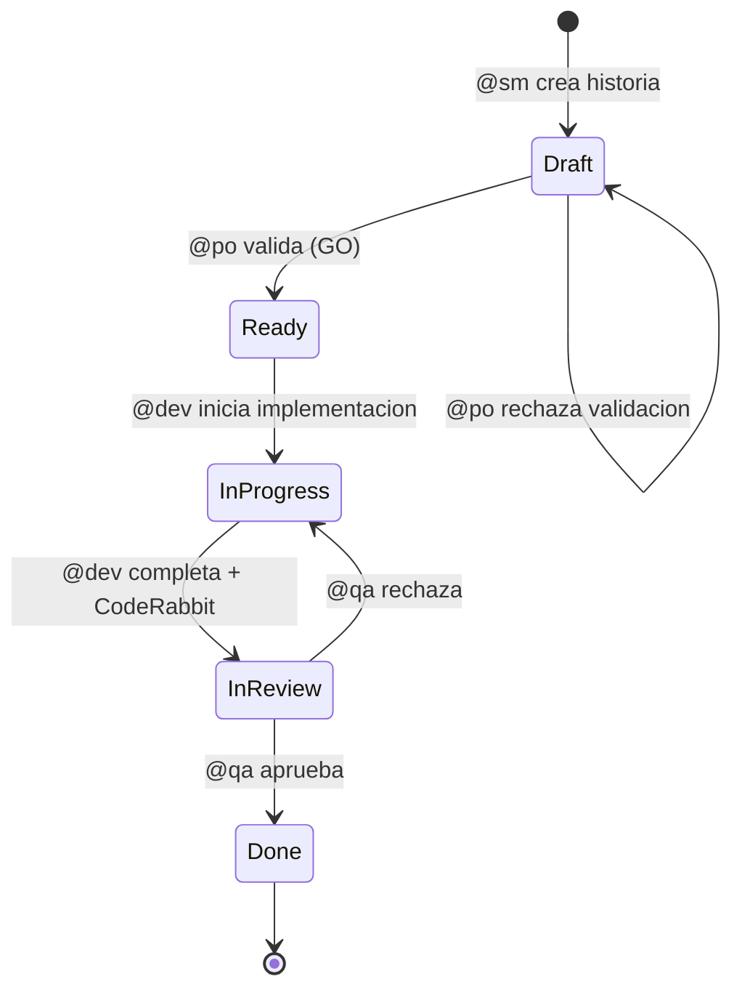

# Ciclo de Desarrollo de Historias

El flujo de trabajo principal para todo el trabajo de desarrollo en AIOS. Automatiza el flujo completo desde la creacion de la historia hasta la entrega, con quality gates integrados.

## Resumen

El Story Development Cycle (SDC) es un flujo de trabajo de 4 fases que orquesta el ciclo de vida completo de una historia: **Crear, Validar, Implementar, QA Gate**. Cada fase es responsabilidad de un agente dedicado, y la historia progresa a traves de transiciones de estado bien definidas en cada etapa.

### Tipos de Proyecto Soportados

| Tipo | Descripcion |
|------|-------------|
| `greenfield` | Proyectos nuevos desde cero |
| `brownfield` | Proyectos existentes y mantenimiento |
| `feature-development` | Desarrollo de nuevas funcionalidades |
| `bug-fix` | Correccion de errores |
| `enhancement` | Mejoras en funcionalidades existentes |

## Diagrama del Flujo de Trabajo

## Progresion de Estado

El estado de la historia registra su progreso a traves del ciclo:

| Estado | Disparador | Agente |
|--------|-----------|--------|
| Draft | Historia creada | @sm |
| Ready | Validacion aprobada (GO) | @po |
| InProgress | Implementacion iniciada | @dev |
| InReview | Implementacion completada | @dev |
| Done | QA gate aprobado | @qa |

## Fase 1: Crear (@sm)

**Agente:** @sm (River -- Scrum Master)
**Task:** `create-next-story.md`

El Scrum Master identifica y crea la siguiente historia del backlog utilizando el PRD fragmentado o la documentacion del proyecto como fuente.

**Entradas:**
- PRD (fragmentado o monolitico)
- Contexto del epic en `docs/stories/epic-X/`

**Salidas:**
- Archivo de historia: `{epicNum}.{storyNum}.story.md`
- Estado definido como **Draft**

**Comandos:**
- `*draft` -- Crear siguiente historia
- `*story-checklist` -- Ejecutar lista de verificacion de historia

## Fase 2: Validar (@po)

**Agente:** @po (Pax -- Product Owner)
**Task:** `validate-next-story.md`

El Product Owner valida la historia usando una lista de verificacion rigurosa de 10 puntos. Una puntuacion de 7 o mas resulta en GO; por debajo de 7 es NO-GO con correcciones obligatorias.

### Lista de Verificacion de 10 Puntos

| # | Verificacion | Descripcion |
|---|-------------|-------------|
| 1 | Titulo claro | El titulo describe precisamente lo que se hara |
| 2 | Descripcion completa | Problema/necesidad claramente explicado |
| 3 | Criterios de aceptacion verificables | Formato Given/When/Then preferido |
| 4 | Alcance bien definido | Lo que esta IN y OUT claramente listado |
| 5 | Dependencias mapeadas | Historias o recursos prerequisitos identificados |
| 6 | Estimacion de complejidad | Story points o estimacion T-shirt |
| 7 | Valor de negocio | Beneficio para el usuario/negocio es claro |
| 8 | Riesgos documentados | Problemas potenciales identificados |
| 9 | Criterios de Done | Definicion clara de cuando esta completa |
| 10 | Alineacion con PRD/Epic | Consistencia con documentos fuente |

**Decision:**
- **GO** (puntuacion ≥ 7): Estado cambia de Draft a **Ready**
- **NO-GO** (puntuacion {'<'} 7): Regresa a @sm con feedback

**Comandos:**
- `*validate-story-draft {story}` -- Validar calidad de la historia

## Fase 3: Implementar (@dev)

**Agente:** @dev (Dex -- Full Stack Developer)
**Task:** `dev-develop-story.md`

El desarrollador implementa la historia validada siguiendo los criterios de aceptacion y tareas definidas. Incluye el CodeRabbit Self-Healing Loop para calidad del codigo.

### Modos de Ejecucion

| Modo | Descripcion | Prompts al Usuario |
|------|-------------|-------------------|
| **YOLO** | Ejecucion autonoma con registro de decisiones | 0-1 |
| **Interactive** | Puntos de decision con feedback educativo (predeterminado) | 5-10 |
| **Pre-Flight** | Planificacion completa antes de la ejecucion | 10-15 (anticipados) |

### CodeRabbit Self-Healing

Durante la implementacion, CodeRabbit ejecuta verificaciones automaticas de calidad:

- Issues **CRITICAL**: auto-fix (maximo 2 iteraciones)
- Issues **HIGH**: auto-fix si iteracion {'<'} 2, de lo contrario documentar como deuda tecnica
- Issues **MEDIUM**: documentar como deuda tecnica
- Issues **LOW**: ignorar

Si issues CRITICAL persisten despues de 2 iteraciones, el flujo de trabajo se detiene y requiere intervencion manual.

**Comandos:**
- `*develop {story-id}` -- Implementar historia
- `*run-tests` -- Ejecutar linting y pruebas
- `*apply-qa-fixes` -- Aplicar correcciones de QA

## Fase 4: QA Gate (@qa)

**Agente:** @qa (Quinn -- Test Architect)
**Task:** `qa-gate.md`

El agente de QA ejecuta la revision final con quality gate, validando codigo, pruebas y adherencia a los criterios de aceptacion.

### 7 Verificaciones de Calidad

| # | Verificacion | Descripcion |
|---|-------------|-------------|
| 1 | Code review | Patrones, legibilidad, mantenibilidad |
| 2 | Pruebas unitarias | Cobertura adecuada, todas pasando |
| 3 | Criterios de aceptacion | Todos cumplidos segun story AC |
| 4 | Sin regresiones | Funcionalidades existentes preservadas |
| 5 | Rendimiento | Dentro de los limites aceptables |
| 6 | Seguridad | OWASP basics verificados |
| 7 | Documentacion | Actualizada si es necesario |

### Veredictos del Gate

| Veredicto | Criterios | Accion |
|-----------|-----------|--------|
| **PASS** | Todos los checks pasan, sin issues HIGH | Aprobar historia, entregar a @devops |
| **CONCERNS** | Issues no bloqueantes presentes | Aprobar con observaciones documentadas |
| **FAIL** | Issues HIGH/CRITICAL presentes | Devolver a @dev con feedback |
| **WAIVED** | Issues explicitamente aceptados | Aprobar con waiver documentado |

**Comandos:**
- `*review {story}` -- Revision integral de historia
- `*gate {story}` -- Crear decision de quality gate

## Despues de QA

- **PASS/CONCERNS:** Historia entregada a @devops para `git push` y creacion de PR. Estado definido como **Done**.
- **FAIL:** El [QA Loop](/es/docs/workflows/qa-loop) se activa para correcciones iterativas (maximo 5 iteraciones).

## Condiciones de Bloqueo

El flujo de trabajo se detiene y solicita intervencion del usuario cuando:

1. Se necesitan dependencias no aprobadas (nueva biblioteca o recurso)
2. La ambiguedad persiste despues de verificar la historia
3. Tres fallos consecutivos de implementacion o correccion
4. Configuracion faltante (`core-config.yaml` o plantillas)
5. Pruebas existentes fallan (fallo de regresion)
