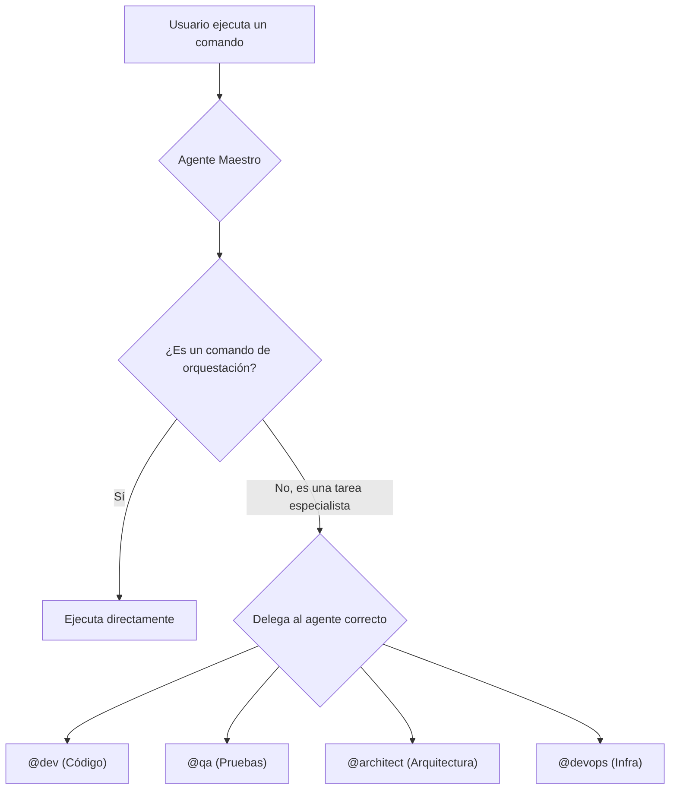

# Comandos Especializados y Delegados

Mientras que el Agente Maestro actúa como orquestador, muchas de las tareas más granulares y específicas de un dominio se delegan a agentes especialistas. Este enfoque asegura que se utilice la herramienta adecuada para cada trabajo, promoviendo un sistema más modular y eficiente.

## El Principio de Delegación

El Agente Maestro (`@aios-master`) raramente realiza tareas de implementación o análisis profundo directamente. En su lugar, invoca a otros agentes que poseen el conocimiento y las herramientas necesarias para la tarea.

Por ejemplo, en lugar de que el Agente Maestro sepa cómo generar una prueba en React, delega esta tarea al agente `@dev`.



### Cómo Invocar Agentes Especialistas

Puede interactuar con agentes especialistas de dos maneras:

1.  **Indirectamente:** A través de un comando del Agente Maestro que orquesta una tarea. Por ejemplo, `*run-workflow story-development-cycle` podría invocar a los agentes `@sm`, `@dev`, y `@qa` en secuencia.
2.  **Directamente:** Activando el agente especialista y usando sus comandos específicos.

```bash
# Activa el agente de desarrollo
*activate @dev

# Ahora, puedes usar los comandos específicos de @dev
*generate-component UserProfile --type react --tests
```

## Categorías de Comandos Especializados

La documentación detallada para los comandos de agentes especialistas se encontrará en las secciones relevantes del `playbook` o en la documentación de referencia de cada agente.

A continuación se presenta un resumen de las categorías de comandos que son responsabilidad de agentes especialistas:

### 👷 Generación de Código (`@dev`)
- Generación de componentes de UI (`*generate-component`)
- Creación de endpoints de API (`*generate-api`)
- Implementación de lógica de negocio

### 🧪 Pruebas y Calidad (`@qa`)
- Generación de suites de pruebas (`*generate-tests`)
- Ejecución de puertas de calidad (`*qa-gate`)
- Bucles de revisión y corrección (`*qa-loop`)

### 🏗️ Arquitectura (`@architect`)
- Generación de diagramas de arquitectura
- Análisis de la estructura del proyecto
- Sugerencias de refactorización a gran escala

###  DevOps (`@devops`)
- Programación de tareas (`*schedule-task`)
- Operaciones de copia de seguridad y restauración (`*backup`, `*restore`)
- Gestión de despliegues (`*deploy`)

La lista completa de comandos para cada agente se puede ver usando el comando `*help` después de activar el agente deseado.
