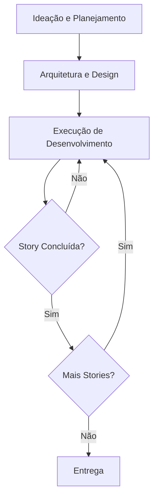
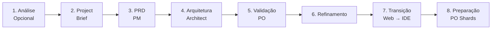
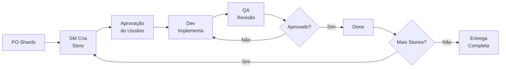

# Arquitetura do Sistema

O Método AIOS é um **meta-framework** que fornece modos agênticos, tarefas e templates para workflows repetíveis. Ele opera como uma camada sobre seu ambiente de desenvolvimento, facilitando todo o ciclo de vida do software — da ideação à entrega.

## Visão Geral

O framework atua em três grandes áreas:

1. **Ideação e Planejamento** — Transformar requisitos informais em especificações executáveis
2. **Arquitetura e Design** — Definir a estrutura técnica com agentes especializados
3. **Execução de Desenvolvimento** — Ciclo contínuo SM → Dev → QA até a entrega

## Componentes Centrais

Todos os componentes residem no diretório `aios-core/` e são organizados da seguinte forma:

### Agentes (`aios-core/agents/`)

Arquivos markdown que definem persona, capacidades e dependências de cada agente. Cada agente possui um papel específico no workflow — desde o Product Manager (`@pm`) que orquestra épicos até o QA (`@qa`) que valida a qualidade.

### Times de Agentes (`aios-core/agent-teams/`)

Pacotes de agentes agrupados para propósitos específicos. Um time combina os agentes necessários para executar um workflow completo, como o time de desenvolvimento (SM + Dev + QA) ou o time de planejamento (PM + Architect + PO).

### Workflows (`aios-core/workflows/`)

Sequências YAML de passos e interações entre agentes. Definem a ordem de execução, condições de entrada/saída e pontos de decisão. Os principais workflows são:

- **Story Development Cycle (SDC)** — Ciclo completo de desenvolvimento
- **QA Loop** — Ciclo iterativo de revisão e correção
- **Spec Pipeline** — Pipeline de especificação pré-implementação
- **Brownfield Discovery** — Avaliação de projetos existentes

### Recursos Reutilizáveis

| Diretório | Conteúdo |
|-----------|----------|
| `templates/` | Templates de documentos com placeholders |
| `tasks/` | Definições de tarefas atômicas com pré/pós-condições |
| `checklists/` | Listas de verificação para gates de qualidade |
| `data/` | Dados de referência e configurações |

## Sistema de Processamento de Templates

O AIOS possui um sistema de templates em três camadas:

- **template-format.md** — Linguagem de marcação com `{{placeholders}}` para valores dinâmicos e `[[LLM: instruções]]` para geração por IA
- **create-doc.md** — Motor de orquestração para geração de documentos a partir de templates
- **advanced-elicitation.md** — Camada de refinamento interativo que coleta informações do usuário de forma estruturada

## Sistema de Preferências Técnicas

O arquivo `technical-preferences.md` permite personalizar o comportamento dos agentes por projeto. Ele influencia decisões de tecnologia, padrões de código e convenções de nomenclatura em todos os agentes que participam do projeto.

## Build e Entrega

O AIOS suporta dois modos de uso:

| Modo | Como Funciona |
|------|---------------|
| **IDE** | Uso direto dos arquivos markdown dos agentes no seu editor |
| **Web UI** | Bundles pré-construídos a partir do diretório `dist/` |

## Workflow de Planejamento

O planejamento segue 8 fases sequenciais antes do desenvolvimento começar:

| Fase | Responsável | Saída |
|------|-------------|-------|
| 1. Análise (opcional) | Analyst | Relatório de análise |
| 2. Project Brief | Usuário/PM | Documento de briefing |
| 3. Criação do PRD | PM | Product Requirements Document |
| 4. Design de Arquitetura | Architect | Documento de arquitetura |
| 5. Validação e Alinhamento | PO | PRD validado |
| 6. Refinamento | PM + PO | PRD refinado |
| 7. Transição de Ambiente | DevOps | Migração web → IDE |
| 8. Preparação de Documentos | PO | Shards do PRD para stories |

## Ciclo Central de Desenvolvimento

Após o planejamento, o desenvolvimento segue um ciclo contínuo e disciplinado:

1. **PO fragmenta o PRD** em shards executáveis
2. **SM cria a story** a partir do shard
3. **Usuário aprova** a story draft
4. **Dev implementa** com self-healing de código (CodeRabbit)
5. **QA revisa** aplicando 7 verificações de qualidade
6. **Story concluída** — ciclo repete para a próxima story

Cada story passa por estados bem definidos: `Draft → Ready → InProgress → InReview → Done`.

## Princípios Arquiteturais

- **Task-First** — Workflows são compostos por tarefas conectadas, não por agentes conectados
- **Agentes como Executores** — Agentes executam tarefas, mas a sequência e as regras vêm das definições de tasks
- **Gates de Qualidade** — Cada transição de estado possui verificações automatizadas
- **IDS (Incremental Development System)** — Hierarquia REUSE {">"} ADAPT {">"} CREATE para evitar duplicação
- **Rastreabilidade** — Todo artefato deve ser rastreável até um requisito documentado
