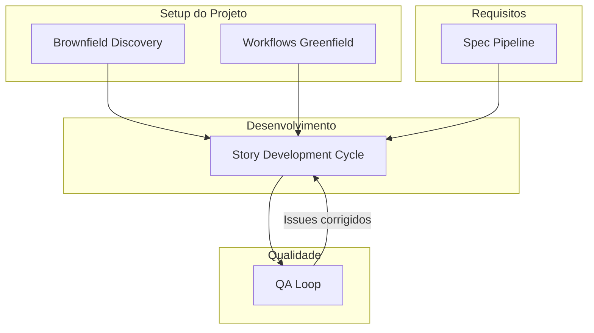

# Workflows -- Referencia

O AIOS disponibiliza um conjunto abrangente de workflows que orquestram o desenvolvimento desde os requisitos ate o deploy. Cada workflow automatiza a coordenacao entre agentes, quality gates e geracao de artefatos.

## Workflows de Processo

Estes workflows definem os processos fundamentais de desenvolvimento usados em todos os tipos de projeto.

### [Story Development Cycle (SDC)](/pt-BR/docs/workflows/story-development-cycle)

O workflow principal para todo trabalho de desenvolvimento. Um ciclo de 4 fases que leva uma story desde a criacao, passando pela validacao, implementacao e garantia de qualidade.

**Agentes envolvidos:** @sm, @po, @dev, @qa, @devops

### [QA Loop](/pt-BR/docs/workflows/qa-loop)

Ciclo automatizado e iterativo de revisao e correcao que executa apos o QA gate inicial. Orquestra a troca entre revisao do @qa e correcoes do @dev ate a story ser aprovada ou escalada.

**Agentes envolvidos:** @qa, @dev

### [Spec Pipeline](/pt-BR/docs/workflows/spec-pipeline)

Transforma requisitos informais em especificacoes executaveis atraves de 6 fases adaptativas. Produz specs validadas com planos de implementacao, adaptando a profundidade com base na complexidade detectada.

**Agentes envolvidos:** @pm, @architect, @analyst, @qa

## Workflows por Tipo de Projeto

Estes workflows configuram o ambiente e o processo de desenvolvimento para tipos especificos de projeto.

### Workflows Greenfield

Para projetos novos, do zero:

| Workflow | Descricao |
|----------|-----------|
| Greenfield Fullstack | Aplicacoes full-stack (frontend + backend + banco de dados) |
| Greenfield Service | Servicos backend/API |
| Greenfield UI | Aplicacoes somente frontend |

### Workflows Brownfield

Para projetos e codebases existentes:

| Workflow | Descricao |
|----------|-----------|
| Brownfield Discovery | Avaliacao de debito tecnico em 10 fases para codebases existentes |
| Brownfield Fullstack | Evolucao de aplicacoes full-stack existentes |
| Brownfield Service | Evolucao de servicos backend/API existentes |
| Brownfield UI | Evolucao de aplicacoes frontend existentes |

### Workflows Adicionais

| Workflow | Descricao |
|----------|-----------|
| Design System Build | Construcao e garantia de qualidade de design systems |
| Auto Worktree | Gestao automatica de git worktrees para desenvolvimento paralelo |

## Guia de Selecao de Workflow

| Situacao | Workflow Recomendado |
|----------|---------------------|
| Nova story a partir de um epic | Story Development Cycle |
| QA encontrou problemas apos revisao | QA Loop |
| Feature complexa precisa de spec formal | Spec Pipeline, depois SDC |
| Entrando em projeto existente | Brownfield Discovery |
| Correcao simples de bug | SDC (modo YOLO) |
| Novo projeto do zero | Workflow Greenfield (Fullstack/Service/UI) |
| Feature em codebase existente | Workflow Brownfield (Fullstack/Service/UI) |
| Construindo um design system | Design System Build |

## Como os Workflows se Conectam

Os workflows sao projetados para encadear. Este e o fluxo tipico:

| De | Para | Condicao |
|----|------|----------|
| Brownfield Discovery | Workflow Brownfield | Apos avaliacao completa |
| Workflow Greenfield | Story Development Cycle | Para cada story do epic |
| Workflow Brownfield | Story Development Cycle | Para cada story do epic |
| Spec Pipeline | Story Development Cycle | Apos spec aprovada |
| Story Development Cycle | QA Loop | Quando o QA gate retorna FAIL |
| QA Loop | Story Development Cycle | Quando issues sao corrigidos e aprovados |
