# Loop de QA

Ciclo automatizado e iterativo de revisao e correcao para melhoria de qualidade apos o QA gate inicial.

## Visao Geral

O QA Loop orquestra o ciclo completo de **Review, Fix, Re-review** apos o QA gate no [Story Development Cycle](/pt-BR/docs/workflows/story-development-cycle) retornar um veredito FAIL. Ele executa ate um maximo configuravel de iteracoes (padrao: 5), rastreando os resultados de cada iteracao. Quando o limite e atingido ou uma parada manual e solicitada, o workflow escala para intervencao humana.

### Proposito

- Automatizar o ciclo de revisao de qualidade entre @qa e @dev
- Reduzir o tempo entre feedback e correcao
- Garantir rastreabilidade completa do processo de QA
- Escalar automaticamente quando necessario

## Como Funciona

```mermaid
flowchart TD
    subgraph INIT["Inicializacao"]
        I1["Carregar/criar loop-status.json"]
        I2["Definir iteration = 0"]
    end

    subgraph REVIEW["Fase 1: QA Review"]
        R1["@qa executa qa-review-story"]
        R2["Gera gate-file.yaml"]
        R3["Retorna verdict + issuesFound"]
    end

    subgraph CHECK["Fase 2: Verificar Veredito"]
        C1{"verdict?"}
        APPROVE["APPROVE"]
        BLOCKED["BLOCKED"]
        REJECT["REJECT"]
    end

    subgraph FIX["Fase 3-4: Corrigir Issues"]
        F1["@qa cria fix-request.md"]
        F2["@dev aplica correcoes"]
        F3["@dev valida com testes"]
    end

    subgraph ITER["Fase 5: Verificar Iteracao"]
        IT1{"iteration ≥ max?"}
        IT2["iteration++"]
    end

    subgraph END["Conclusao"]
        E1["COMPLETE -- Story Aprovada"]
        E2["ESCALATE -- Requer Humano"]
    end

    I1 --> I2 --> R1
    R1 --> R2 --> R3 --> C1
    C1 -->|"APPROVE"| APPROVE --> E1
    C1 -->|"BLOCKED"| BLOCKED --> E2
    C1 -->|"REJECT"| REJECT --> F1
    F1 --> F2 --> F3 --> IT1
    IT1 -->|"Sim"| E2
    IT1 -->|"Nao"| IT2 --> R1
```



## Comandos

| Comando | Descricao |
|---------|-----------|
| `*qa-loop {storyId}` | Iniciar QA loop completo |
| `*qa-loop-review` | Iniciar apenas do step de review |
| `*qa-loop-fix` | Iniciar apenas do step de fix |
| `*stop-qa-loop` | Pausar loop e salvar estado |
| `*resume-qa-loop` | Retomar do estado salvo ou escalado |
| `*escalate-qa-loop` | Forcar escalacao manual |
| `*qa-loop --reset` | Deletar arquivo de status e reiniciar |

## Steps em Detalhe

### Step 1: QA Review

**Agente:** @qa (Quinn)
**Task:** `qa-review-story.md`
**Timeout:** 30 minutos

@qa realiza uma revisao abrangente da implementacao da story, executando o CodeRabbit em modo completo de self-healing (ate 3 iteracoes para issues CRITICAL/HIGH) antes de conduzir a analise manual.

**Saidas:** `gate-file.yaml` com veredito e contagem de issues

### Step 2: Verificar Veredito

O sistema avalia o veredito da revisao:

| Veredito | Acao |
|----------|------|
| **APPROVE** | Completar o loop, marcar story como Done |
| **REJECT** | Continuar para criar fix request |
| **BLOCKED** | Escalar imediatamente para humano |

### Step 3: Criar Fix Request

**Agente:** @qa (Quinn)
**Task:** `qa-create-fix-request.md`

Gera um documento estruturado `QA_FIX_REQUEST.md` a partir dos findings da revisao, priorizando issues e fornecendo instrucoes acionaveis de correcao para @dev.

### Step 4: Aplicar Correcoes

**Agente:** @dev (Dex)
**Task:** `dev-apply-qa-fixes.md`
**Timeout:** 60 minutos

@dev aplica as correcoes baseadas no fix request, executa testes e valida as mudancas. Atualiza o arquivo da story e o Dev Agent Record.

### Step 5: Verificar Iteracao

O sistema incrementa o contador de iteracao e verifica contra o maximo. Se o max for atingido, escala para intervencao humana. Caso contrario, o loop retorna ao Step 1.

## 7 Verificacoes de Qualidade

Em cada iteracao de review, @qa avalia:

| # | Verificacao | Descricao |
|---|-------------|-----------|
| 1 | Code review | Padroes, legibilidade, manutenibilidade |
| 2 | Testes unitarios | Cobertura adequada, todos passando |
| 3 | Criterios de aceitacao | Todos atendidos conforme story AC |
| 4 | Sem regressoes | Funcionalidades existentes preservadas |
| 5 | Performance | Dentro dos limites aceitaveis |
| 6 | Seguranca | OWASP basics verificados |
| 7 | Documentacao | Atualizada se necessario |

## Configuracao

Opcoes principais de configuracao em `.aios-core/core-config.yaml`:

```yaml
autoClaude:
  qaLoop:
    maxIterations: 5       # Maximo de iteracoes review-fix
    reviewTimeout: 1800000 # 30 minutos por review
    fixTimeout: 3600000    # 60 minutos por fix
```

**Arquivo de rastreamento de status:** `qa/loop-status.json`

O arquivo de status registra o historico completo de cada iteracao, incluindo vereditos, contagem de issues e timestamps.

## Escalacao

### Gatilhos

O loop escala automaticamente nestas situacoes:

| Gatilho | Descricao |
|---------|-----------|
| `max_iterations_reached` | Loop atingiu o maximo sem APPROVE |
| `verdict_blocked` | @qa retornou BLOCKED |
| `fix_failure` | @dev nao conseguiu aplicar correcoes apos retries |
| `manual_escalate` | Usuario executou `*escalate-qa-loop` |

### Contexto de Escalacao

Quando ocorre escalacao, o sistema fornece um pacote completo de contexto:

- `loop-status.json` -- Status completo do loop com historico
- Todos os gate files de cada iteracao
- Todos os fix requests gerados
- Resumo de todas as iteracoes

### Apos Escalacao

O usuario pode:
1. Retomar o loop: `*resume-qa-loop`
2. Corrigir manualmente e aprovar a story
3. Rejeitar a story e criar um follow-up

## Integracao com CodeRabbit

Durante o QA Loop, o CodeRabbit opera em **modo completo**:

```yaml
self_healing:
  type: full
  max_iterations: 3
  severity_filter: [CRITICAL, HIGH]
  behavior:
    CRITICAL: auto_fix
    HIGH: auto_fix
    MEDIUM: document_as_debt
    LOW: ignore
```

O self-healing do CodeRabbit executa como pre-step antes da analise manual de QA em cada iteracao de review. Isso garante que issues automatizados sejam resolvidos antes da revisao de nivel arquitetural e rastreabilidade.

## Parar e Retomar

O QA Loop suporta pausa e retomada a qualquer momento:

1. **Parar:** Execute `*stop-qa-loop` para salvar o estado atual (status fica `stopped`)
2. **Retomar:** Execute `*resume-qa-loop` para recarregar o estado e continuar de onde parou

Isso e util para pausas, consultas com membros da equipe ou aguardar dependencias externas.
