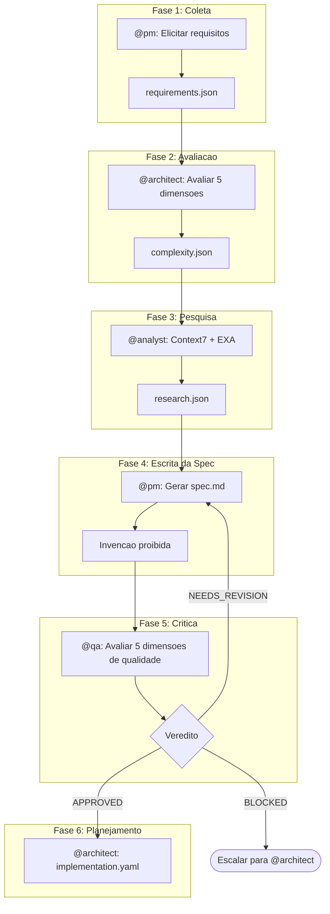
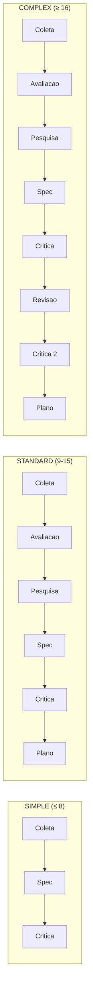

# Pipeline de Especificacao

Transforme requisitos informais em especificacoes executaveis atraves de um workflow adaptativo de multiplas fases.

## Visao Geral

O Spec Pipeline e um workflow orquestrado que transforma descricoes de usuarios em especificacoes formais e estruturadas. Ele implementa um fluxo de ate 6 fases que se adaptam dinamicamente com base na complexidade detectada do requisito. O pipeline garante qualidade atraves de gates de validacao e reforca a rastreabilidade desde os requisitos ate a implementacao.

### Principios Fundamentais

| Principio | Descricao |
|-----------|-----------|
| **No Invention** | Nenhuma informacao fabricada -- somente derivacao dos inputs |
| **Traceability** | Toda afirmacao deve rastrear para um requisito ou descoberta de pesquisa |
| **Adaptive Phases** | Fases se ajustam automaticamente com base na complexidade |
| **Quality Gates** | Validacao obrigatoria antes de avancar |

## Fluxo do Pipeline

## As 6 Fases

### Fase 1: Coleta de Requisitos

**Agente:** @pm (Morgan)
**Task:** `spec-gather-requirements.md`

Elicitacao interativa em 9 categorias de perguntas:

1. **Funcionais** -- O que o sistema deve FAZER?
2. **Restricoes** -- Restricoes tecnicas ou de negocio?
3. **Nao-Funcionais** -- Performance, seguranca, escalabilidade?
4. **Aceitacao** -- Criterios Given/When/Then?
5. **Suposicoes** -- O que esta sendo assumido?
6. **Dominio** -- Entidades e relacionamentos?
7. **Interacao** -- Como o usuario interage?
8. **Edge Cases** -- O que pode dar errado?
9. **Terminologia** -- Glossario especifico do dominio?

**Saida:** `requirements.json` com requisitos estruturados (FR-\*, NFR-\*, CON-\*)

### Fase 2: Avaliar Complexidade

**Agente:** @architect (Aria)
**Task:** `spec-assess-complexity.md`
**Pulada quando:** `source=simple` ou override manual para SIMPLE

Avalia 5 dimensoes de complexidade, cada uma pontuada de 1 a 5:

| Dimensao | Score 1 | Score 3 | Score 5 |
|----------|---------|---------|---------|
| **Escopo** | 1-2 arquivos | 6-10 arquivos | 20+ arquivos |
| **Integracao** | Sem APIs externas | 1-2 APIs externas | Multiplas orquestracoes |
| **Infraestrutura** | Sem mudancas | Nova dependencia | Nova infraestrutura |
| **Conhecimento** | Padroes existentes | Nova biblioteca | Dominio desconhecido |
| **Risco** | Baixo, isolado | Medio, importante | Critico, core do sistema |

**Saida:** `complexity.json` com classificacao

### Fase 3: Pesquisar Dependencias

**Agente:** @analyst (Atlas)
**Task:** `spec-research-dependencies.md`
**Pulada quando:** Classe de complexidade e SIMPLE

Valida dependencias usando Context7 (primario) e EXA (fallback). Verifica a codebase em busca de padroes existentes, imports e entradas no `package.json`.

**Saida:** `research.json` com dependencias validadas

### Fase 4: Escrever Especificacao

**Agente:** @pm (Morgan)
**Task:** `spec-write-spec.md`
**Gate Constitucional:** Artigo IV -- Proibicao de Invencao

Gera o documento formal de especificacao. Toda afirmacao DEVE rastrear para um requisito (FR-\*, NFR-\*, CON-\*) ou uma descoberta de pesquisa verificada. Violacoes sao bloqueadas -- conteudo inventado e removido ou adicionado a Open Questions.

**Saida:** `spec.md` com especificacao completa incluindo arquitetura, fluxo de dados, estrategia de testes e checklist de implementacao

### Fase 5: Criticar Especificacao

**Agente:** @qa (Quinn)
**Task:** `spec-critique.md`

Avalia a especificacao em 5 dimensoes de qualidade:

| Dimensao | Peso | Verifica |
|----------|------|----------|
| **Precisao** | 25% | A spec reflete corretamente os requisitos? |
| **Completude** | 25% | Todas as secoes preenchidas? Testes cobrem FRs? |
| **Consistencia** | 20% | IDs validos? Sem contradicoes? |
| **Viabilidade** | 15% | Tecnicamente possivel? Dependencias existem? |
| **Alinhamento** | 15% | Alinhado com stack e padroes do projeto? |

**Saida:** `critique.json` com veredito

### Fase 6: Criar Plano de Implementacao

**Agente:** @architect (Aria)
**Task:** `plan-create-implementation.md`
**Condicao:** Veredito da critica e APPROVED

Gera um plano de implementacao atomico com subtasks:

| Regra | Descricao |
|-------|-----------|
| Servico Unico | 1 servico por subtask (frontend, backend, banco de dados, infra) |
| Limite de Arquivos | Maximo 3 arquivos por subtask |
| Verificacao Obrigatoria | Cada subtask DEVE ter verificacao definida |
| Ordem de Dependencias | Banco de Dados, depois Backend, depois Frontend, depois Integracao |

**Saida:** `implementation.yaml` com subtasks ordenadas

## Classes de Complexidade

A pontuacao total de complexidade determina quais fases estao ativas e a profundidade do pipeline:

| Pontuacao | Classe | Fases Ativas | Tempo Estimado |
|-----------|--------|-------------|----------------|
| ≤ 8 | **SIMPLE** | Coleta, Spec, Critica (3 fases) | 30-60 min |
| 9-15 | **STANDARD** | Todas as 6 fases | 2-4 horas |
| ≥ 16 | **COMPLEX** | 6 fases + Revisao + Segunda Critica | 4-8 horas |

## Vereditos da Critica

| Veredito | Condicao | Proxima Acao |
|----------|----------|--------------|
| **APPROVED** | Sem issues HIGH, media ≥ 4.0, todas dimensoes ≥ 3 | Prosseguir para Plano (Fase 6) |
| **NEEDS_REVISION** | Issues MEDIUM ou media 3.0-3.9 | Retornar para Escrita da Spec (Fase 4) |
| **BLOCKED** | Issues HIGH ou media {'<'} 3.0 | Escalar para @architect |

## Gate Constitucional: Artigo IV -- Proibicao de Invencao

Esta e uma regra de aplicacao estrita durante a escrita da spec:

- Toda afirmacao no `spec.md` DEVE rastrear para FR-\*, NFR-\*, CON-\* ou uma descoberta de pesquisa verificada
- Adicionar features nao listadas nos requisitos e uma **violacao**
- Assumir detalhes nao validados pela pesquisa e uma **violacao**
- Especificar tecnologia nao validada e uma **violacao**
- Criar criterios de aceitacao inventados e uma **violacao**

Em caso de violacao: o conteudo e **bloqueado e removido**, ou movido para a secao **Open Questions** para acompanhamento.

## Comandos

| Comando | Descricao | Agente |
|---------|-----------|--------|
| `*create-spec STORY-ID` | Executar pipeline completo | -- |
| `*gather-requirements STORY-ID` | Executar apenas fase Coleta | @pm |
| `*assess-complexity STORY-ID` | Executar apenas fase Avaliacao | @architect |
| `*research-deps STORY-ID` | Executar apenas fase Pesquisa | @analyst |
| `*write-spec STORY-ID` | Executar apenas fase Escrita | @pm |
| `*critique-spec STORY-ID` | Executar apenas fase Critica | @qa |

## Artefatos Gerados

Todos os artefatos sao salvos em `docs/stories/{storyId}/spec/`:

| Artefato | Fase | Descricao |
|----------|------|-----------|
| `requirements.json` | 1 | Requisitos estruturados em 9 categorias |
| `complexity.json` | 2 | Avaliacao de complexidade com 5 dimensoes |
| `research.json` | 3 | Dependencias validadas e descobertas de pesquisa |
| `spec.md` | 4 | Especificacao executavel completa |
| `critique.json` | 5 | Resultado da avaliacao de qualidade |
| `implementation.yaml` | 6 | Plano de implementacao com subtasks atomicas |
