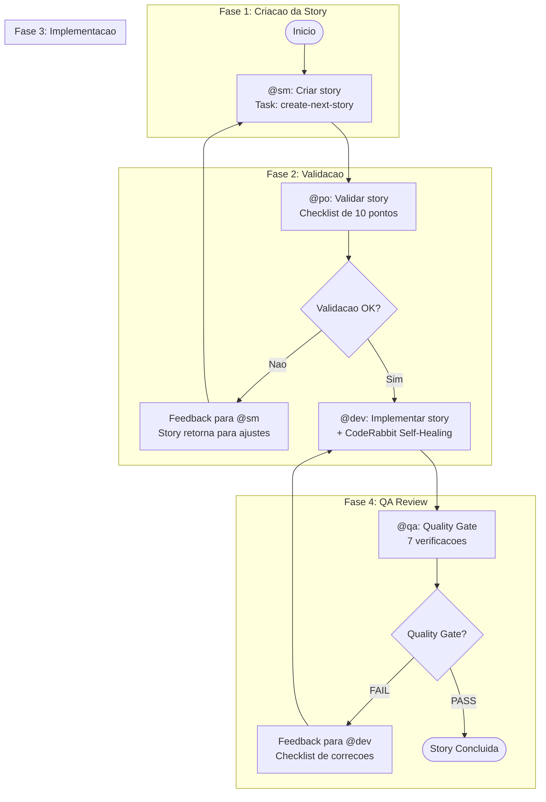
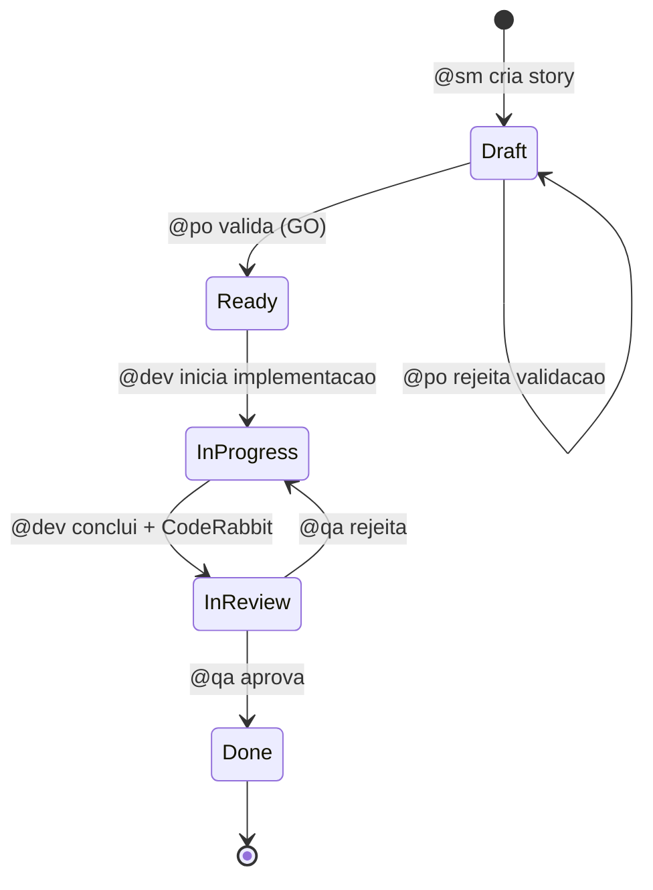

# Ciclo de Desenvolvimento de Stories

O workflow principal para todo trabalho de desenvolvimento no AIOS. Automatiza o fluxo completo desde a criacao da story ate a entrega, com quality gates integrados.

## Visao Geral

O Story Development Cycle (SDC) e um workflow de 4 fases que orquestra o ciclo de vida completo de uma story: **Criar, Validar, Implementar, QA Gate**. Cada fase e de responsabilidade de um agente dedicado, e a story progride por transicoes de status bem definidas em cada etapa.

### Tipos de Projeto Suportados

| Tipo | Descricao |
|------|-----------|
| `greenfield` | Projetos novos, do zero |
| `brownfield` | Projetos existentes e manutencao |
| `feature-development` | Desenvolvimento de novas funcionalidades |
| `bug-fix` | Correcao de bugs |
| `enhancement` | Melhorias em funcionalidades existentes |

## Diagrama do Workflow

## Progressao de Status

O status da story acompanha seu progresso pelo ciclo:

| Status | Gatilho | Agente |
|--------|---------|--------|
| Draft | Story criada | @sm |
| Ready | Validacao aprovada (GO) | @po |
| InProgress | Implementacao iniciada | @dev |
| InReview | Implementacao concluida | @dev |
| Done | QA gate aprovado | @qa |

## Fase 1: Criar (@sm)

**Agente:** @sm (River -- Scrum Master)
**Task:** `create-next-story.md`

O Scrum Master identifica e cria a proxima story do backlog utilizando o PRD shardado ou documentacao do projeto como fonte.

**Entradas:**
- PRD (shardado ou monolitico)
- Contexto do epic em `docs/stories/epic-X/`

**Saidas:**
- Arquivo da story: `{epicNum}.{storyNum}.story.md`
- Status definido como **Draft**

**Comandos:**
- `*draft` -- Criar proxima story
- `*story-checklist` -- Executar checklist de story

## Fase 2: Validar (@po)

**Agente:** @po (Pax -- Product Owner)
**Task:** `validate-next-story.md`

O Product Owner valida a story usando um checklist rigoroso de 10 pontos. Uma pontuacao de 7 ou mais resulta em GO; abaixo de 7 e NO-GO com correcoes obrigatorias.

### Checklist de Validacao de 10 Pontos

| # | Verificacao | Descricao |
|---|-------------|-----------|
| 1 | Titulo claro | O titulo descreve precisamente o que sera feito |
| 2 | Descricao completa | Problema/necessidade claramente explicado |
| 3 | Criterios de aceitacao testaveis | Formato Given/When/Then preferido |
| 4 | Escopo bem definido | O que esta IN e OUT claramente listado |
| 5 | Dependencias mapeadas | Stories ou recursos pre-requisitos identificados |
| 6 | Estimativa de complexidade | Story points ou T-shirt sizing |
| 7 | Valor de negocio | Beneficio para o usuario/negocio e claro |
| 8 | Riscos documentados | Potenciais problemas identificados |
| 9 | Criterios de Done | Definicao clara de quando esta completa |
| 10 | Alinhamento com PRD/Epic | Consistencia com documentos fonte |

**Decisao:**
- **GO** (pontuacao ≥ 7): Status muda de Draft para **Ready**
- **NO-GO** (pontuacao {'<'} 7): Retorna para @sm com feedback

**Comandos:**
- `*validate-story-draft {story}` -- Validar qualidade da story

## Fase 3: Implementar (@dev)

**Agente:** @dev (Dex -- Full Stack Developer)
**Task:** `dev-develop-story.md`

O desenvolvedor implementa a story validada seguindo os criterios de aceitacao e tarefas definidas. Inclui o CodeRabbit Self-Healing Loop para qualidade do codigo.

### Modos de Execucao

| Modo | Descricao | Prompts ao Usuario |
|------|-----------|-------------------|
| **YOLO** | Execucao autonoma com logging de decisoes | 0-1 |
| **Interactive** | Checkpoints de decisao com feedback educacional (padrao) | 5-10 |
| **Pre-Flight** | Planejamento completo antes da execucao | 10-15 (upfront) |

### CodeRabbit Self-Healing

Durante a implementacao, o CodeRabbit executa verificacoes automaticas de qualidade:

- Issues **CRITICAL**: auto-fix (maximo 2 iteracoes)
- Issues **HIGH**: auto-fix se iteracao {'<'} 2, caso contrario documenta como tech debt
- Issues **MEDIUM**: documenta como tech debt
- Issues **LOW**: ignora

Se issues CRITICAL persistirem apos 2 iteracoes, o workflow para e requer intervencao manual.

**Comandos:**
- `*develop {story-id}` -- Implementar story
- `*run-tests` -- Executar linting e testes
- `*apply-qa-fixes` -- Aplicar correcoes do QA

## Fase 4: QA Gate (@qa)

**Agente:** @qa (Quinn -- Test Architect)
**Task:** `qa-gate.md`

O agente de QA executa o review final com quality gate, validando codigo, testes e aderencia aos criterios de aceitacao.

### 7 Verificacoes de Qualidade

| # | Verificacao | Descricao |
|---|-------------|-----------|
| 1 | Code review | Padroes, legibilidade, manutenibilidade |
| 2 | Testes unitarios | Cobertura adequada, todos passando |
| 3 | Criterios de aceitacao | Todos atendidos conforme story AC |
| 4 | Sem regressoes | Funcionalidades existentes preservadas |
| 5 | Performance | Dentro dos limites aceitaveis |
| 6 | Seguranca | OWASP basics verificados |
| 7 | Documentacao | Atualizada se necessario |

### Vereditos do Gate

| Veredito | Criterios | Acao |
|----------|-----------|------|
| **PASS** | Todos os checks passam, sem issues HIGH | Aprovar story, encaminhar para @devops |
| **CONCERNS** | Issues nao-bloqueantes presentes | Aprovar com observacoes documentadas |
| **FAIL** | Issues HIGH/CRITICAL presentes | Retornar para @dev com feedback |
| **WAIVED** | Issues explicitamente aceitos | Aprovar com waiver documentado |

**Comandos:**
- `*review {story}` -- Review abrangente de story
- `*gate {story}` -- Criar decisao de quality gate

## Apos o QA

- **PASS/CONCERNS:** Story encaminhada para @devops para `git push` e criacao de PR. Status definido como **Done**.
- **FAIL:** O [QA Loop](/pt-BR/docs/workflows/qa-loop) entra em acao para correcoes iterativas (maximo 5 iteracoes).

## Condicoes de Bloqueio

O workflow para e solicita intervencao do usuario quando:

1. Dependencias nao aprovadas sao necessarias (nova biblioteca ou recurso)
2. Ambiguidade permanece apos verificar a story
3. Tres falhas consecutivas de implementacao ou correcao
4. Configuracao ausente (`core-config.yaml` ou templates)
5. Testes existentes quebram (falha de regressao)
