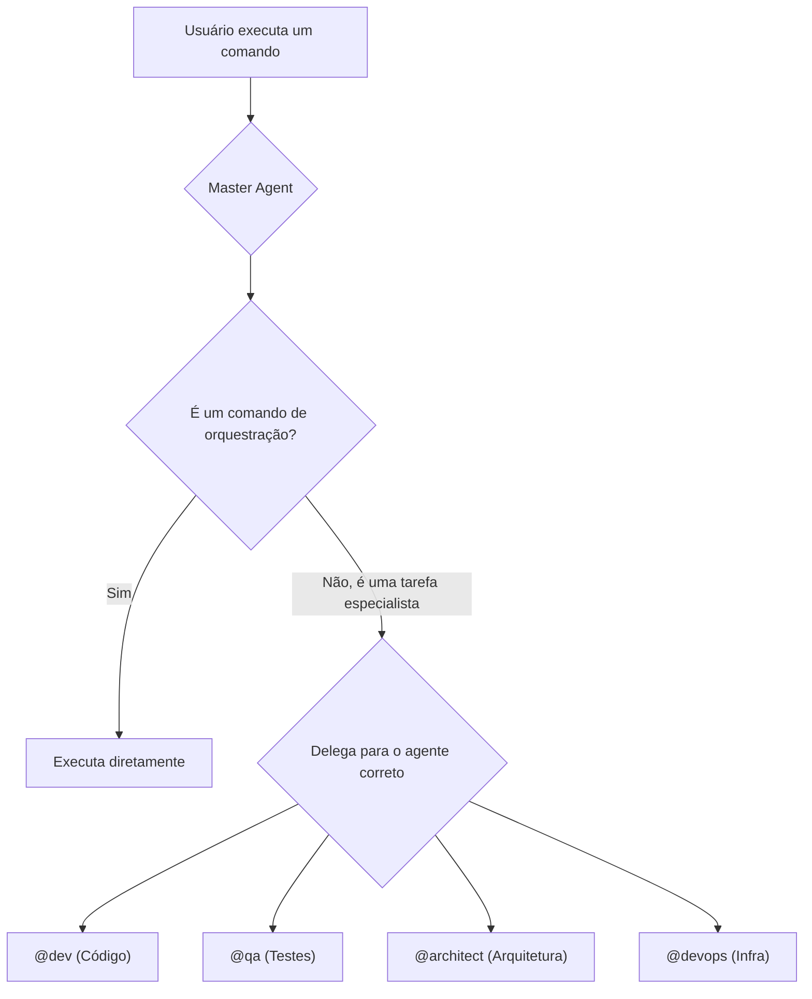

# Comandos Especializados e Delegados

Enquanto o Master Agent atua como o orquestrador, muitas das tarefas mais granulares e específicas de um domínio são delegadas a agentes especialistas. Esta abordagem garante que a ferramenta certa seja usada para cada trabalho, promovendo um sistema mais modular e eficiente.

## O Princípio da Delegação

O Master Agent (`@aios-master`) raramente executa tarefas de implementação ou análise profunda diretamente. Em vez disso, ele invoca outros agentes que possuem o conhecimento e as ferramentas necessárias para a tarefa.

Por exemplo, ao invés do Master Agent saber como gerar um teste em React, ele delega essa tarefa ao agente `@dev`.



### Como Invocar Agentes Especialistas

Você pode interagir com agentes especialistas de duas formas:

1.  **Indiretamente:** Através de um comando do Master Agent que orquestra uma tarefa. Por exemplo, `*run-workflow story-development-cycle` pode invocar os agentes `@sm`, `@dev`, e `@qa` em sequência.
2.  **Diretamente:** Ativando o agente especialista e usando seus comandos específicos.

```bash
# Ativa o agente de desenvolvimento
*activate @dev

# Agora, você pode usar comandos específicos do @dev
*generate-component UserProfile --type react --tests
```

## Categorias de Comandos Especializados

A documentação detalhada para os comandos de agentes especialistas será encontrada nas seções relevantes do `playbook` ou na documentação de referência de cada agente.

Abaixo está uma visão geral das categorias de comandos que são de responsabilidade de agentes especialistas:

### 👷 Geração de Código (`@dev`)
- Geração de componentes de UI (`*generate-component`)
- Criação de endpoints de API (`*generate-api`)
- Implementação de lógica de negócios

### 🧪 Testes e Qualidade (`@qa`)
- Geração de suítes de teste (`*generate-tests`)
- Execução de quality gates (`*qa-gate`)
- Loops de revisão e correção (`*qa-loop`)

### 🏗️ Arquitetura (`@architect`)
- Geração de diagramas de arquitetura
- Análise de estrutura de projeto
- Sugestões de refatoração em larga escala

###  DevOps (`@devops`)
- Agendamento de tarefas (`*schedule-task`)
- Operações de backup e restauração (`*backup`, `*restore`)
- Gestão de deploy (`*deploy`)

A lista completa de comandos para cada agente pode ser visualizada usando o comando `*help` após ativar o agente desejado.
