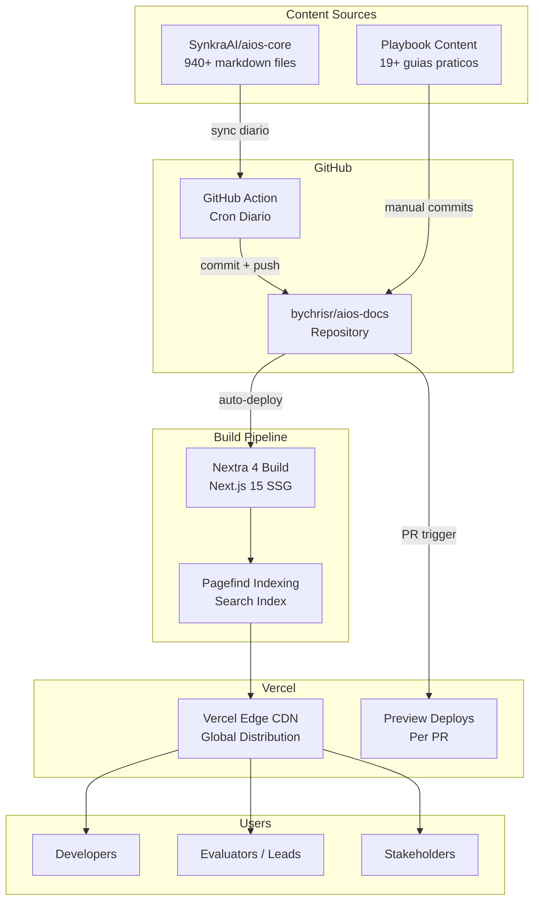
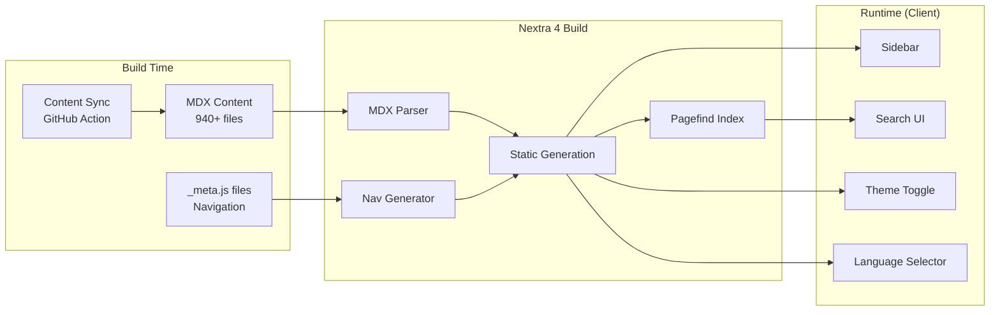
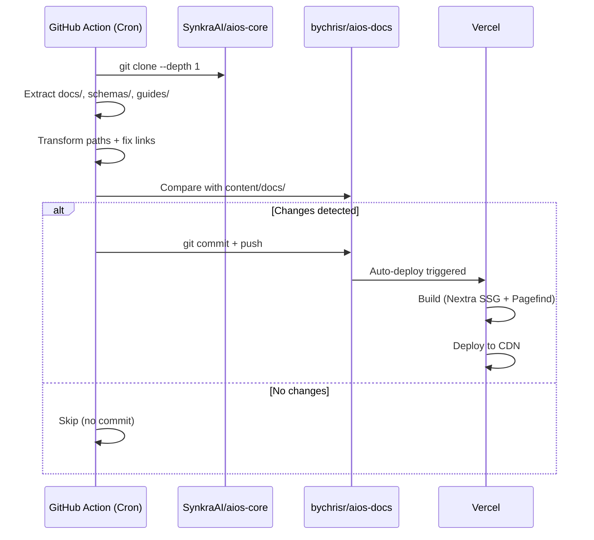
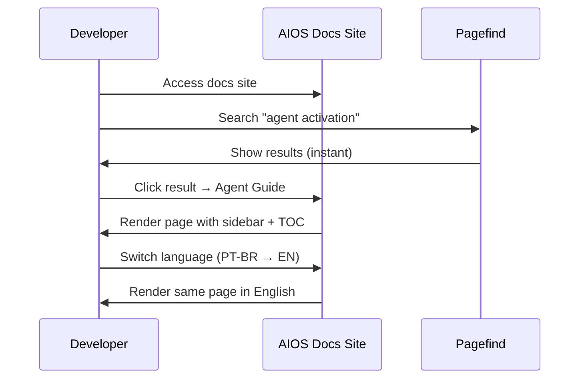

# AIOS Docs — Fullstack Architecture Document

**Status:** Approved
**Version:** 1.0.0
**Date:** 2026-02-16
**Author:** Aria (Architect Agent)

## Change Log

| Date | Version | Description | Author |
|------|---------|-------------|--------|
| 2026-02-15 | 0.1 | Initial stub | Aria |
| 2026-02-16 | 1.0.0 | Complete architecture document | Aria |

---

## 1. Introduction

Este documento define a arquitetura completa do **AIOS Docs** — um site de documentacao publica que transforma os 940+ arquivos markdown do repositorio `SynkraAI/aios-core` em uma experiencia web navegavel, multi-idioma e com busca full-text.

O projeto e **majoritariamente frontend/static** — nao ha backend custom, database, ou autenticacao. A arquitetura cobre:

- **Frontend:** Nextra 4 (Next.js 15 App Router) com SSG
- **Infra:** Vercel deploy + GitHub Action para sync de conteudo
- **Content Pipeline:** Sync automatizado do aios-core → aios-docs

### Starter Template

**Nextra 4** (nextra + nextra-theme-docs) sobre Next.js 15 App Router. Nextra fornece:

- Theme de docs com sidebar hierarquica, TOC, breadcrumbs
- Pagefind (Rust-powered) para busca full-text
- MDX support (React components em markdown)
- i18n nativo via Next.js Internationalized Routing
- Dark mode built-in com toggle
- Turbopack support para dev rapido
- Mermaid rendering nativo

---

## 2. High Level Architecture

### 2.1 Technical Summary

AIOS Docs e um site de documentacao estatico (SSG) construido com Nextra 4 sobre Next.js 15 App Router, deployado na Vercel. O conteudo vem de duas fontes: documentacao tecnica sincronizada automaticamente do repositorio `SynkraAI/aios-core` via GitHub Action diaria, e conteudo proprio do Playbook (guias praticos). O site oferece navegacao estruturada com sidebar hierarquica, busca full-text via Pagefind, e suporte a 3 idiomas (PT-BR, EN, ES). Todas as paginas sao pre-renderizadas em build time, resultando em zero server-side runtime.

### 2.2 Platform and Infrastructure

**Platform:** Vercel (Next.js native hosting)
**Key Services:** Vercel Edge Network (CDN), GitHub Actions (CI/CD + content sync)
**Regions:** Auto (Vercel Edge global distribution)

**Rationale:** Vercel e a plataforma nativa do Next.js/Nextra, com zero-config deploy, preview deployments por PR, e edge distribution global. Nao ha necessidade de servicos adicionais (sem DB, sem auth, sem API).

### 2.3 Repository Structure

**Structure:** Single repository (aios-docs)
**Monorepo Tool:** N/A (projeto simples, sem packages separados)

O conteudo do aios-core e copiado via GitHub Action para o diretorio `content/docs/` — nao usa git submodule para evitar complexidade de build.

### 2.4 High Level Architecture Diagram



### 2.5 Architectural Patterns

- **Jamstack (SSG):** Todas as paginas pre-renderizadas em build time, servidas via CDN. Zero server runtime. _Rationale:_ Performance maxima e custo zero de hosting para sites estaticos.
- **Content Directory Convention:** MDX files organizados em `content/` com catch-all route `[[...mdxPath]]/page.jsx`. _Rationale:_ Padrao Nextra 4 que permite 940+ files sem criar rotas manuais.
- **Filesystem-based Navigation:** `_meta.js` files definem ordem e labels da sidebar. _Rationale:_ Navegacao declarativa sem codigo custom, facil de manter.
- **Content Sync Pipeline:** GitHub Action com clone shallow + diff para sincronizar apenas mudancas. _Rationale:_ Evita dependencia direta (submodule) e permite transformacoes no conteudo durante sync.

---

## 3. Tech Stack

| Category | Technology | Version | Purpose | Rationale |
|----------|-----------|---------|---------|-----------|
| Framework | Nextra | 4.x | Documentation framework | Built-in docs theme, search, i18n, dark mode |
| Runtime | Next.js | 15.x | App Router, SSG, routing | Plataforma base do Nextra 4 |
| Language | TypeScript | 5.x | Type safety em configs e components | Padrao Next.js, previne erros |
| Content | MDX | 3.x | Markdown + React components | Permite componentes interativos na doc |
| Search | Pagefind | 1.x | Full-text search (Rust-powered) | Nativo Nextra 4, rapido, estatico |
| Styling | CSS Modules + Nextra Theme | - | Estilos do tema + customizacoes | Nextra theme-docs fornece estilos base |
| Diagrams | Mermaid | 11.x | Diagramas inline em markdown | Extensivamente usado na doc aios-core |
| Deploy | Vercel | - | Hosting + CDN + Preview deploys | Plataforma nativa Next.js |
| CI/CD | GitHub Actions | - | Content sync + build triggers | Integrado ao GitHub, cron support |
| Package Manager | npm | 10.x | Dependency management | Default do Node.js, sem overhead |
| Bundler | Turbopack | - | Dev server bundling (Rust-powered) | 10x mais rapido que webpack no dev |
| Node.js | Node.js | 20.x LTS | Runtime para build | LTS estavel para producao |

### Secoes N/A

As seguintes categorias nao se aplicam a este projeto (site estatico de documentacao):

- **Backend Framework:** N/A (sem backend custom)
- **Database:** N/A (sem persistencia)
- **Cache:** N/A (CDN e suficiente)
- **Authentication:** N/A (site publico)
- **State Management:** N/A (sem estado complexo)
- **API Style:** N/A (sem API)
- **ORM:** N/A (sem database)

---

## 4. Data Models

N/A — Este projeto e um site de documentacao estatico. Nao ha entidades de negocio, database, ou data models. O "modelo" e o proprio conteudo markdown/MDX organizado em diretorio.

---

## 5. API Specification

N/A — Sem API backend. O site e 100% estatico (SSG).

---

## 6. Components

### 6.1 Content Sync Engine (GitHub Action)

**Responsibility:** Sincronizar documentacao do aios-core para aios-docs diariamente.

**Key Interfaces:**
- Input: `SynkraAI/aios-core` repository (docs, schemas, guides)
- Output: `content/docs/` directory no aios-docs

**Technology:** GitHub Actions workflow com cron schedule

### 6.2 Nextra Documentation App

**Responsibility:** Renderizar conteudo markdown/MDX como site navegavel.

**Key Interfaces:**
- Input: `content/` directory (markdown/MDX files + `_meta.js`)
- Output: HTML estatico pre-renderizado

**Technology:** Nextra 4 + nextra-theme-docs

### 6.3 Navigation System

**Responsibility:** Sidebar hierarquica, breadcrumbs, TOC.

**Key Interfaces:**
- Input: `_meta.js` files em cada diretorio
- Output: Sidebar com secoes colapsaveis, pagina atual destacada

**Technology:** Nextra built-in (filesystem-based)

### 6.4 Search Engine

**Responsibility:** Busca full-text em todo o conteudo.

**Key Interfaces:**
- Input: HTML gerado no build
- Output: Index Pagefind + UI de busca

**Technology:** Pagefind (indexa no build, busca client-side)

### 6.5 i18n System

**Responsibility:** Suporte multi-idioma (PT-BR, EN, ES).

**Key Interfaces:**
- Input: Locale config + arquivos por idioma
- Output: Routing por locale, seletor de idioma

**Technology:** Next.js Internationalized Routing

### 6.6 Landing Page

**Responsibility:** Pagina inicial com overview do AIOS, quick links, getting started.

**Key Interfaces:**
- Input: MDX com React components customizados
- Output: Hero section, feature cards, quick navigation

**Technology:** MDX + React components



---

## 7. External APIs

N/A — Sem integracoes externas. O unico "servico externo" e o repositorio SynkraAI/aios-core como fonte de conteudo, acessado via `git clone` na GitHub Action.

---

## 8. Core Workflows

### 8.1 Content Sync Workflow



### 8.2 Developer Documentation Workflow



---

## 9. Database Schema

N/A — Sem database.

---

## 10. Frontend Architecture

### 10.1 Component Architecture

```
content/                          # Content directory (Nextra convention)
├── _meta.js                      # Root navigation
├── index.mdx                     # Landing page
├── docs/                         # aios-core synced content
│   ├── _meta.js
│   ├── guides/
│   │   ├── _meta.js
│   │   └── *.mdx
│   ├── agents/
│   │   ├── _meta.js
│   │   └── *.mdx
│   ├── workflows/
│   │   ├── _meta.js
│   │   └── *.mdx
│   ├── architecture/
│   │   ├── _meta.js
│   │   └── *.mdx
│   └── reference/
│       ├── _meta.js
│       └── *.mdx
├── playbook/                     # Custom content (own)
│   ├── _meta.js
│   ├── getting-started/
│   ├── workflows/
│   ├── templates/
│   ├── checklists/
│   ├── commands/
│   └── trails/
└── about/                        # About AIOS
    ├── _meta.js
    └── index.mdx
```

### 10.2 App Structure (Next.js App Router)

```
app/
├── layout.tsx                    # Root layout (Nextra theme config)
├── [[...mdxPath]]/
│   └── page.tsx                  # Catch-all route for content
├── not-found.tsx                 # Custom 404
└── global.css                    # Global styles / theme overrides
```

### 10.3 Root Layout Pattern

```typescript
// app/layout.tsx
import { Footer, Layout, Navbar } from 'nextra-theme-docs'
import { Head } from 'nextra/components'
import { getPageMap } from 'nextra/page-map'
import 'nextra-theme-docs/style.css'
import './global.css'

export const metadata = {
  title: {
    default: 'Synkra AIOS Docs',
    template: '%s | AIOS Docs'
  },
  description: 'Documentation for the Synkra AIOS Framework',
  openGraph: {
    title: 'Synkra AIOS Docs',
    description: 'AI-Orchestrated System for Full Stack Development',
    siteName: 'AIOS Docs'
  }
}

const navbar = (
  <Navbar
    logo={<span style={{ fontWeight: 800 }}>Synkra AIOS</span>}
    projectLink="https://github.com/SynkraAI/aios-core"
  />
)

const footer = (
  <Footer>
    MIT {new Date().getFullYear()} © Synkra AI
  </Footer>
)

export default async function RootLayout({ children }) {
  const pageMap = await getPageMap()
  return (
    <html lang="pt-BR" dir="ltr" suppressHydrationWarning>
      <Head />
      <body>
        <Layout
          navbar={navbar}
          pageMap={pageMap}
          docsRepositoryBase="https://github.com/SynkraAI/aios-core/tree/main"
          footer={footer}
          editLink="Edit this page"
          sidebar={{ defaultMenuCollapseLevel: 1 }}
          toc={{ title: 'Nesta pagina' }}
        >
          {children}
        </Layout>
      </body>
    </html>
  )
}
```

### 10.4 Navigation (_meta.js)

```javascript
// content/_meta.js
export default {
  index: {
    title: 'Home',
    type: 'page',
    display: 'hidden'
  },
  docs: {
    title: 'Documentation',
    type: 'page'
  },
  playbook: {
    title: 'Playbook',
    type: 'page'
  },
  about: {
    title: 'About',
    type: 'page'
  }
}
```

### 10.5 Routing Architecture

Nextra 4 usa content directory convention com catch-all route:

- `content/docs/guides/quickstart.mdx` → `/docs/guides/quickstart`
- `content/playbook/getting-started/index.mdx` → `/playbook/getting-started`
- `content/index.mdx` → `/`

Nao ha rotas protegidas (site publico).

### 10.6 State Management

N/A — Sem estado complexo. Theme toggle (dark/light) e gerenciado pelo Nextra theme internamente. Search state e gerenciado pelo Pagefind.

---

## 11. Backend Architecture

N/A — Sem backend custom. O "backend" e:

1. **GitHub Actions** — Content sync cron job
2. **Vercel Build** — SSG build pipeline
3. **Vercel CDN** — Servir HTML estatico

---

## 12. Unified Project Structure

```
aios-docs/
├── .github/
│   └── workflows/
│       └── sync-content.yml        # Daily sync from aios-core
├── app/
│   ├── layout.tsx                  # Root layout with Nextra theme
│   ├── [[...mdxPath]]/
│   │   └── page.tsx                # Catch-all MDX route
│   ├── not-found.tsx               # Custom 404 page
│   └── global.css                  # Theme overrides
├── content/
│   ├── _meta.js                    # Root navigation config
│   ├── index.mdx                   # Landing page
│   ├── docs/                       # Synced from aios-core
│   │   ├── _meta.js
│   │   ├── guides/
│   │   ├── agents/
│   │   ├── workflows/
│   │   ├── architecture/
│   │   └── reference/
│   └── playbook/                   # Custom playbook content
│       ├── _meta.js
│       ├── getting-started/
│       ├── workflows/
│       ├── templates/
│       ├── checklists/
│       ├── commands/
│       └── trails/
├── components/                     # Custom React components
│   ├── landing/
│   │   ├── Hero.tsx
│   │   ├── FeatureCard.tsx
│   │   └── QuickLinks.tsx
│   └── shared/
│       └── MermaidDiagram.tsx       # Mermaid rendering component
├── public/
│   ├── favicon.ico
│   ├── og-image.png
│   └── images/
├── scripts/
│   └── sync-content.sh             # Content sync script
├── next.config.mjs                 # Nextra + Next.js config
├── mdx-components.tsx              # Global MDX component overrides
├── package.json
├── tsconfig.json
├── .env.example                    # GITHUB_TOKEN for sync
└── README.md
```

---

## 13. Development Workflow

### 13.1 Prerequisites

```bash
node -v  # >= 20.x LTS
npm -v   # >= 10.x
git -v   # Any recent version
```

### 13.2 Initial Setup

```bash
git clone https://github.com/bychrisr/aios-docs.git
cd aios-docs
npm install
npm run dev
# Site disponivel em http://localhost:3000
```

### 13.3 Development Commands

```bash
# Start dev server (Turbopack)
npm run dev

# Build for production
npm run build

# Start production server (local test)
npm run start

# Sync content from aios-core (manual)
npm run sync

# Lint
npm run lint
```

### 13.4 Environment Variables

```bash
# .env.example
GITHUB_TOKEN=ghp_xxx          # Para sync privado (opcional se aios-core for publico)
NEXT_PUBLIC_SITE_URL=https://docs.synkra.ai
```

---

## 14. Deployment Architecture

### 14.1 Deployment Strategy

**Frontend Deployment:**
- **Platform:** Vercel
- **Build Command:** `next build`
- **Output:** Static HTML + Pagefind index
- **CDN:** Vercel Edge Network (global)
- **Preview:** Auto-deploy por PR

**Backend Deployment:** N/A

### 14.2 CI/CD Pipeline

```yaml
# .github/workflows/sync-content.yml
name: Sync AIOS Core Docs

on:
  schedule:
    - cron: '0 6 * * *'    # Daily at 6:00 UTC
  workflow_dispatch:         # Manual trigger

jobs:
  sync:
    runs-on: ubuntu-latest
    steps:
      - uses: actions/checkout@v4

      - name: Clone aios-core docs
        run: |
          git clone --depth 1 https://github.com/SynkraAI/aios-core.git /tmp/aios-core

      - name: Sync content
        run: bash scripts/sync-content.sh /tmp/aios-core

      - name: Check for changes
        id: changes
        run: |
          git diff --quiet content/ && echo "changed=false" >> $GITHUB_OUTPUT || echo "changed=true" >> $GITHUB_OUTPUT

      - name: Commit and push
        if: steps.changes.outputs.changed == 'true'
        run: |
          git config user.name "AIOS Sync Bot"
          git config user.email "sync@synkra.ai"
          git add content/docs/
          git commit -m "docs: sync content from aios-core [automated]"
          git push
```

### 14.3 Environments

| Environment | URL | Purpose |
|-------------|-----|---------|
| Development | http://localhost:3000 | Local development |
| Preview | https://aios-docs-*.vercel.app | PR preview deploys |
| Production | https://docs.synkra.ai | Live site |

---

## 15. Security and Performance

### 15.1 Security

**Frontend Security:**
- CSP Headers: Configurado via `vercel.json` (script-src, style-src)
- XSS Prevention: Nextra/React sanitizam conteudo por padrao
- No secrets: Site 100% publico, sem dados sensiveis

**Content Security:**
- Sync script valida que conteudo vem apenas do repositorio oficial
- GitHub Action usa token com read-only access ao aios-core

### 15.2 Performance

**Frontend Performance:**
- **Bundle Size Target:** < 200KB JS (Nextra theme minificado)
- **Loading Strategy:** SSG (zero JS necessario para content rendering)
- **Caching:** Vercel Edge Cache com immutable assets
- **Lighthouse Target:** >= 90 em todas as metricas (NFR2)

**Build Performance:**
- **Build Time Target:** < 3 minutos para 940+ paginas (NFR1)
- **Turbopack:** Usado no dev para hot reload < 1s
- **Pagefind:** Indexacao Rust-powered, tipicamente < 30s para 1000+ paginas

---

## 16. Testing Strategy

### 16.1 Testing Pyramid

```
        E2E (Playwright)
       /                \
  Build Verification Tests
     /                    \
  Lint + TypeCheck    Content Validation
```

### 16.2 Test Types

**Build Verification:**
- `next build` completa sem erros
- Todas as paginas sao geradas (smoke test)
- Pagefind index e criado

**Content Validation:**
- Links internos validos (no broken links)
- _meta.js files consistentes com conteudo
- MDX files parseable sem erros

**E2E (futuro, se necessario):**
- Navegacao funciona
- Search retorna resultados
- Theme toggle funciona
- Language switcher funciona

### 16.3 Commands

```bash
npm run lint          # ESLint
npm run typecheck     # TypeScript compiler
npm run build         # Build verification (implicitly tests everything)
```

---

## 17. Coding Standards

### 17.1 Critical Rules

- **Content in content/:** Todo conteudo MDX vive em `content/`, nunca em `app/`
- **_meta.js obrigatorio:** Todo diretorio em `content/` deve ter `_meta.js` para navegacao
- **No server components com state:** Site e SSG, nao usar `use client` desnecessariamente
- **Edit links corretos:** `docsRepositoryBase` deve apontar para o repo correto de cada secao

### 17.2 Naming Conventions

| Element | Convention | Example |
|---------|-----------|---------|
| Content files | kebab-case.mdx | `agent-activation.mdx` |
| Components | PascalCase.tsx | `FeatureCard.tsx` |
| Config files | camelCase | `next.config.mjs` |
| _meta files | _meta.js | `_meta.js` |
| Directories | kebab-case | `getting-started/` |

---

## 18. Error Handling

**Build Errors:**
- MDX parse error → Fix markdown syntax, check for unescaped JSX
- _meta.js mismatch → Ensure all referenced files exist
- Pagefind failure → Check build output HTML is valid

**Runtime Errors:**
- 404 → Custom `not-found.tsx` with search suggestion
- Search empty → Pagefind graceful fallback ("Nenhum resultado")

---

## 19. Monitoring

**Vercel Analytics** (built-in):
- Page views, unique visitors
- Core Web Vitals (LCP, FID, CLS)
- Build time tracking

**GitHub Actions:**
- Sync job success/failure notifications
- Build time per deploy

---

## 20. i18n Strategy

### Phase 1 (MVP): PT-BR Only
- Site em PT-BR como idioma padrao
- Conteudo do aios-core (ja em PT-BR)
- Playbook em PT-BR

### Phase 2: Multi-idioma
- Adicionar EN e ES via Next.js i18n routing
- Locale-based file convention: `content/docs/guides/quickstart.en.mdx`
- Language selector no navbar
- next.config.mjs com `i18n: { locales: ['pt-BR', 'en', 'es'], defaultLocale: 'pt-BR' }`

**Rationale:** Iniciar com PT-BR permite entregar valor rapido. i18n e adicionado incrementalmente quando traducoes estiverem prontas. O aios-core ja tem conteudo em 3 idiomas que pode ser mapeado.

---

*— Aria, arquitetando o futuro*
